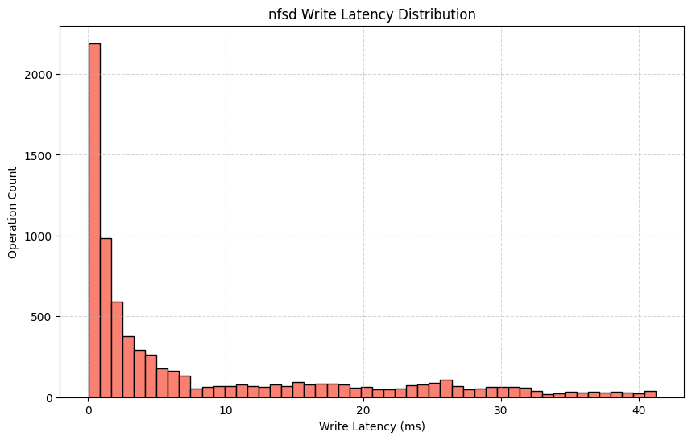
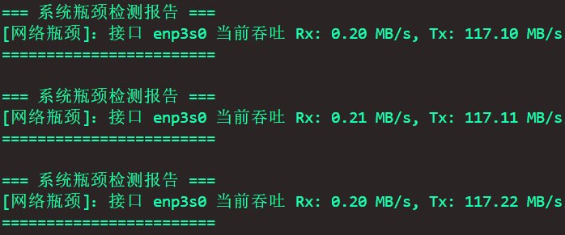

# NFSDIG-面向NFS文件系统的深度可观测性与智能调优框架


## 项目目录
- [NFSDIG-面向NFS文件系统的深度可观测性与智能调优框架](#nfsdig-面向nfs文件系统的深度可观测性与智能调优框架)
  - [项目目录](#项目目录)
  - [一、概述](#一概述)
  - [二、项目详细介绍](#二项目详细介绍)
    - [2.1 项目背景与动机](#21-项目背景与动机)
      - [2.1.1 构建全栈可观测性：NFSDIG实现NFS系统的深度透明化洞察](#211-构建全栈可观测性nfsdig实现nfs系统的深度透明化洞察)
      - [2.1.2 突破传统：面向全栈可观测性的NFS故障定位新范式](#212-突破传统面向全栈可观测性的nfs故障定位新范式)
      - [2.1.3 超越离线寻优：基于eBPF的在线自适应配置调优实践](#213-超越离线寻优基于ebpf的在线自适应配置调优实践)
    - [2.2 项目设计](#22-项目设计)
      - [2.2.1 项目整体架构：构建一体化可观测性框架，实现监控、调优与诊断的协同闭环](#221-项目整体架构构建一体化可观测性框架实现监控调优与诊断的协同闭环)
      - [2.2.2 项目设计理念与核心技术点：融合低开销观测与智能自适应机制，打造高效易用的NFS优化范式](#222-项目设计理念与核心技术点融合低开销观测与智能自适应机制打造高效易用的nfs优化范式)
      - [2.2.3  项目核心功能分析：融合追踪、管理与调优，打造NFS全生命周期智能运维框架](#223--项目核心功能分析融合追踪管理与调优打造nfs全生命周期智能运维框架)
    - [2.3 项目完成情况与未来展望](#23-项目完成情况与未来展望)
      - [2.3.1 项目初赛行动项与完成情况：从概念到实现的跨越](#231-项目初赛行动项与完成情况从概念到实现的跨越)
      - [2.3.2 项目决赛行动项与完成情况：深化与扩展](#232-项目决赛行动项与完成情况深化与扩展)
      - [2.3.3 未来展望：迈向自治存储系统的下一步](#233-未来展望迈向自治存储系统的下一步)
  - [三、测试评估与功能展示](#三测试评估与功能展示)
    - [3.1 跟踪功能展示与故障定位案例分析](#31-跟踪功能展示与故障定位案例分析)
      - [3.1.1 跟踪功能展示](#311-跟踪功能展示)
      - [3.1.2 NFSDIG故障定位功能分析](#312-nfsdig故障定位功能分析)
    - [3.2 ebpf开销测试](#32-ebpf开销测试)
    - [3.3 配置调优模块测试](#33-配置调优模块测试)
      - [3.3.1 配置调优性能测试](#331-配置调优性能测试)
      - [3.3.2 负载场景分类准确性测试](#332-负载场景分类准确性测试)
      - [3.3.3 与四种主流搜索算法搜索效率对比测试](#333-与四种主流搜索算法搜索效率对比测试)
      - [3.3.4 动态场景下的性能优化能力测试](#334-动态场景下的性能优化能力测试)
    - [3.4 异常检测算法测试结果](#34-异常检测算法测试结果)
      - [3.4.1 系统指标异常检测的性能评估](#341-系统指标异常检测的性能评估)
      - [3.4.2 NFS系统负载突变场景下的性能评估](#342-nfs系统负载突变场景下的性能评估)
  - [四、答辩与演示](#四答辩与演示)
  - [五、参考与引用](#五参考与引用)
  - [六、项目目录](#六项目目录)


## 一、概述

赛题：proj293-Fault-Analysis-of-NFS-File-System-Based-on-eBPF（`https://github.com/oscomp/proj293-Fault-Analysis-of-NFS-File-System-Based-on-eBPF`）

**1.1 项目概述** 

NFS 作为现代企业级存储架构的核心组件，通过跨平台资源共享显著提升了数据管理效率与资源利用率。然而，在高并发、多变负载及复杂网络环境下，其性能波动难追踪、运行异常难定位、配置机制静态僵化等问题日益凸显。传统监控工具普遍存在观测盲区：或局限于宏观指标（如 I/O 吞吐），缺乏语义级洞察；或聚焦局部路径（如网络抓包），难以穿透内核执行栈；更缺乏对客户端与服务端协同行为的全链路追踪能力，导致故障根因分析耗时长、MTTR（平均修复时间）居高不下。

为应对上述挑战，我们设计并实现了 **NFSDIG** —— 一款**面向NFS文件系统的深度可观测性与智能调优框架**。NFSDIG基于eBPF构建了覆盖 CPU、内存、网络、磁盘与文件系统的**多层次监控体系**，并通过“粗粒度监控 + 细粒度触发”的分层策略，在保障低运行开销的同时，实现对关键异常的精准捕获。框架支持从应用系统调用到服务端磁盘 I/O 的**全链路追踪**，利用 XID、文件句柄等通用标识实现跨主机因果关联，**还原请求完整路径**，显著提升可观测深度。

在故障定位方面，NFSDIG 构建“异常感知—行为捕获—因果推断”的闭环流程：通过 JumpStarter 等多维算法识别系统级异常（如 CPU 飙升、I/O 瓶颈），触发 eBPF 深度跟踪；针对 NFS 操作级延迟突增，创新性提出 **EWMAControl-3-Sigma** 异常检测算法，在真实场景中 **F1-score 达传统方法的 2 倍以上，推理耗时不足 JumpStarter 的 1%**。结合跨节点调用链重建机制，NFSDIG 在 **32 类故障场景中成功定位全部异常**，**简化 30 类故障的诊断流程**，显著降低 MTTR。

在配置调优方面，NFSDIG 采用 OFFLINE + ONLINE 双阶段自适应配置调优范式：离线阶段通过贝叶斯优化生成“负载场景—最优参数”映射库；在线阶段基于高精度神经网络分类器实时识别负载类型，动态切换配置。该方法在真实负载下与默认参数相比实现**吞吐量提升 35%、延时降低 40%**；与基于Q-Learning 的调优方法进行对比，实现**吞吐量提升20%，延时降低24%**，突破了传统静态调参的局限，为 NFS 系统的持续性能优化提供了可落地的解决方案。

综上，NFSDIG 不仅实现了对 NFS 全栈行为的深度透明化洞察，更构建了“监控—诊断—调优”闭环的智能运维能力，为复杂分布式存储系统的深度可观测性与智能调优构建了新框架。

**1.2 赛题简介**

网络文件系统（NFS）是一个分布式文件系统协议，允许客户端计算机用户通过网络访问文件，就像访问本地存储一样。尽管NFS被广泛使用且相对稳定，但在高负载或特定配置下，NFS客户端和服务器之间仍然可能遇到性能瓶颈或故障。本项目旨在利用eBPF技术，深入分析和诊断NFS文件系统的性能问题和故障模式，提高NFS的稳定性和效率。

赛题要求如下：
- 基于eBPF开发系统监控与跟踪工具
- 分析文件系统操作的延迟和吞吐量以识别瓶颈
- 诊断常见NFS故障
- 提出配置调优或代码修改建议


**1.3 主要工作**

项目对于**赛题目标的整体完成情况**如下表所示：

| 赛题目标 | 完成情况 | 完成说明 | 
| ---------------------------- | -------- | ------------------------------- |
| 基于eBPF开发系统监控与跟踪工具  | 全部完成 |  开发基于eBPF的多层次监控 + 全链路追踪体系，还原请求完整路径，显著提升可观测深度 |
| 开发文件系统操作自动化分析算法  | 全部完成 | 基于SOTA方法Jumpstarter判断系统异常状态，提出 EWMAControl-3-Sigma 异常检测算法识别NFS操作级延迟突增，基于监控数据进行宏观瓶颈分析 | 
| 诊断常见NFS故障，分析常见性能瓶颈 | 全部完成 |   收集19类32个故障案例，成功定位全部故障的操作级别，为其中30个故障的修复提供更强大的上下文信息  | 
|  开发算法进行配置调优或代码修改 | 全部完成 | 提出OFFLINE + ONLINE 双阶段自适应调优范式，真实负载下与默认参数相比实现**吞吐量提升 35%、延时降低 40%**；与基于Q-Learning 的调优方法进行对比，实现**吞吐量提升20%，延时降低24%** |                 

---

我们**初赛**阶段的主要工作包括：

<div align="center">

| 实现内容                      | 完成情况 | 说明                            |
| ---------------------------- | -------- | ------------------------------- |
| 1. 开发全面的nfs系统监控工具                   | 全部完成（100%） |      综合各种linux系统监控工具，提供NFS文件系统包括CPU, 内存, 网络, 磁盘等模块的全面监控      |
|  2. 利用ebpf开发细粒度的nfs事件跟踪框架        | 大部分完成（90%） |     对nfs读写事件，rpc收发事件和nfs内部函数操作提供进程级，文件级和函数级的细粒度跟踪              |
|  3. 提供nfs系统性能异常和故障的预警和定位信息      | 大部分完成（80%） |  1.  能够针对网络延迟、挂载失败、CPU使用率过高等多种故障场景提供预警和定位信息 2. 能够针对异常NFS操作提供预警信息  3. 初步寻找了故障案例             |
| 4. 实现工具的可扩展性、低开销和易用性                  | 基本完成（65%） |      1. 对NFSDIG工具进行多维度性能测试，其监控的性能开销仅在4%以内；2. 提高NFSDIG用户态Agent的易用性和可扩展性，扩展ebpf跟踪程序的功能  3. 初步实现了NFS的挂载管理          |
|  5. 实现nfs不同负载场景的动态配置调优     | 基本完成（75%） |   1. 针对多种负载场景实现了nfs挂载参数的配置调优，场景分类准确率达到98.5%，吞吐量比默认配置平均提升15%，延时平均降低25%。2. 实现了负载分析与场景分类 |
</div>

---

我们**决赛**阶段的主要工作包括：
<div align="center">

| 实现内容                      | 完成情况 | 说明                            |
| ---------------------------- | -------- | ------------------------------- |  
|  开发NFS全链路的事件跟踪框架        | 全部完成 |   开发了系统调用层、vfs层、网络层和磁盘层的跟踪，设计了跟踪数据的分析整合          |
|  针对现实故障案例进行归纳分析      | 全部完成 |   1. 收集19类32个故障场景 2. 分析全部故障案例并给出针对性方法 3. 成功定位全部故障并为其中30个故障的修复提供更强大的上下文信息          |
| 实现工具的可扩展性、低开销和易用性                  | 全部完成 |  完善跟踪工具的可定制接口、完善用户态的参数解析与可视化输出，完善eBPF事件过滤机制          |
|  优化nfs负载分析以及场景调优流程     | 全部完成 | 1.引入KMeans算法对NFS负载进行聚类，实现场景智能划分，平衡了负载场景覆盖率与配置调整开销   2.优化搜索算法，在参数搜索过程中引入启发式动态权重得分函数  3.吞吐量比默认配置平均提升35%，延时平均降低40%，与初赛相比有较大提升 |
|  实现NFS性能瓶颈分析     | 全部完成 | 根据NFS多层次指标收集框架分析系统CPU、内存、网络等性能瓶颈  |
|  扩展了异常检测算法的评估 | 全部完成 | 在公开数据集SMD上完成Jumpstarter异常检测算法的评估, 将EWMAControl-3-sigma应用于NFS细粒度操作时延，操作数，吞吐量等检测以反映NFS系统负载的变化。完成两种算法的推理时间开销比较 | 
| 基于autofs的挂载管理 |  全部完成       |  利用 autofs 动态挂载不同参数的NFS挂载点，在需要时自动切换到对应配置并在空闲时自动卸载，避免频繁手动挂载/卸载     |
</div>


## 二、项目详细介绍
### 2.1 项目背景与动机

虽然 NFS 在实际应用中已被广泛采用，但仍存在性能波动、权限管理复杂及可靠性不足等问题。本赛题要求参赛者重点利用 eBPF 技术对 NFS 文件系统进行深入分析与故障诊断，并鼓励采用创新方法监控、分析和解决其性能与稳定性问题。  

#### 2.1.1 构建全栈可观测性：NFSDIG实现NFS系统的深度透明化洞察

传统文件系统分析工具（如 df、iostat）主要聚焦于磁盘 I/O 层面的宏观性能指标，缺乏对上层文件系统语义操作的深入观测能力。尽管部分基于 eBPF 的工具（如 nfsslower、nfsdist）已能够追踪至 NFS 协议层，实现对特定操作延迟或调用频次的细粒度监控，但其观测范围仍局限于局部路径，难以覆盖完整的执行栈，**存在显著的监控盲区**。此外，nfstrace 等网络抓包工具虽增强了 NFS RPC 通信过程的可见性，但受限于用户态抓包机制，无法深入解析客户端与服务端内核路径中的关键内部状态与执行逻辑，因而**对深层次性能瓶颈或故障根因的诊断能力有限**。

针对上述局限，我们设计并实现了 NFSDIG，一个基于 eBPF 的综合性性能分析与诊断框架。相较于现有工具，NFSDIG 显著提升了监控的深度与广度，提供了**更为精细、结构化且语义丰富的运行时洞察**，为 NFS 系统的性能分析、异常诊断与优化调参奠定了坚实的数据基础。

#### 2.1.2 突破传统：面向全栈可观测性的NFS故障定位新范式

NFS文件系统的故障定位是一项高度复杂的系统性挑战，涉及跨节点网络通信、各端点本地文件系统行为，以及服务端为支持并发访问而引入的协议级优化机制（如写委托、缓存一致性等）之间的深层交互。传统诊断方法通常将NFS视为单纯的网络协议栈，依赖Wireshark等工具进行网络抓包分析，虽能还原RPC请求/响应序列，但无法透视内核路径中的执行状态与上下文切换，因而难以揭示性能退化或异常行为的深层根因。

尽管eBPF技术为内核可观测性带来了革命性进展，当前多数工具仍存在实用性与深度的局限。例如，pwru虽支持精细化的网络路径追踪，但其输出以底层事件流为主，语义抽象层级高，**缺乏自动化的问题归因能力**，对非专家用户门槛较高；而DeepFlow、vNetTracer等分布式追踪框架虽整合了eBPF数据源，其分析重心仍集中于网络拓扑与微服务调用链，在操作系统内核子系统（如VFS、页缓存、I/O调度）的**细粒度行为观测方面覆盖不足**。

针对上述问题，我们设计并实现了NFSDIG，提出一种分层插桩与上下文关联机制，在保证低运行时开销的前提下，实现对NFS全栈执行路径的系统性可观测性。该全链路追踪能力使得NFSDIG不仅能够识别表层异常，更能**深入解析复杂交互场景下的隐性故障模式**，为NFS系统的快速诊断与可靠运维提供了强有力的技术支撑。

#### 2.1.3 超越离线寻优：基于eBPF的在线自适应配置调优实践

在NFS等复杂分布式存储系统中，配置参数对系统性能具有显著影响。现代存储栈通常暴露大量可调参数（如读写缓冲区大小、预读策略、超时阈值、并发连接数等），用于精细控制数据路径的行为。已有研究证实，仅对参数空间中的关键子集进行优化，即可在特定工作负载下实现能效与性能的显著提升，增益幅度最高可达9倍。然而，传统的调优方法多依赖离线建模或静态基准测试，在预设负载场景下搜索理论最优配置，严重忽视了生产环境中负载模式的多样性和动态演化特性。此类静态策略在面对突发流量、混合I/O负载或访问模式漂移时往往表现不佳，甚至可能因配置错配引发性能劣化。

为应对这一挑战，我们提出一种**基于运行时感知的动态配置调优新范式**：依托eBPF技术构建高保真、低开销的负载感知机制，实时采集跨层系统行为数据，并据此驱动配置参数的自适应调整。该机制不仅显著提升了参数调优的时效性与适用性，也有效缓解了人工调参的认知负担与误配置风险，为构建自优化（self-tuning）存储系统提供了可落地的技术路径。


### 2.2 项目设计

本项目**NFSDIG**旨在解决网络文件系统（NFS）在实际部署与运维过程中面临的性能波动难以追踪、运行异常难以定位以及参数机制静态僵化等问题。为此，我们提出了一个基于eBPF技术的性能分析、配置调优和故障诊断框架。整个项目的总体设计可以概括为以下三大板块：

#### 2.2.1 项目整体架构：构建一体化可观测性框架，实现监控、调优与诊断的协同闭环

NFSDIG由一个监控跟踪体系和两个功能模块组成，其整体流程框架图如下所示：

<!--  -->
<div align="center">

</div>


- **全面多层次监控与跟踪体系**：该体系旨在构建一个覆盖全面、开销可控、时空维度协同的可观测性框架，实现对 NFS 全链路执行路径的深度观测与异常溯源支持，为后续的故障定位与性能调优提供高保真数据基础。
  - 在时间维度上，采用"**粗粒度监控 + 细粒度触发**"的分层采集策略，结合 Linux 内核统计接口与 eBPF 动态探针，实现低开销的系统状态感知，并在检测到性能偏离时自动激活深度跟踪机制。
  - 在空间维度上，纵向贯穿应用层、VFS 层、NFS 客户端/服务端、RPC 层、网络协议栈至块设备 I/O 层，构建**跨层级的事件关联拓扑**，确保性能瓶颈与异常行为可在系统软件栈中被精确定位。
  - 支持**全链路请求追踪**，通过多种通用标识进行请求事件的因果关联。如在服务端使用唯一事务标识（如 XID）关联rpc请求接受与服务端nfsd响应完成的完整执行流，实现跨主机、跨内核模块的调用路径重建，提升复杂分布式环境下的可观测性。


- **高效异常检测与故障定位机制**：
  本机制致力于实现对 NFS 运行时异常的快速识别、精准归因与根因推导，构建"**异常感知—行为捕获—因果推断**"的闭环诊断流程，显著降低平均故障修复时间（MTTR）。
  - 利用 JumpStarter 等多维异常检测算法，实时分析系统资源指标（CPU、I/O、网络等），识别潜在的性能退化或服务异常，并触发细粒度 eBPF 跟踪程序以捕获异常任务的执行上下文。
  - 针对 NFS 操作级异常（如读写延迟突增、RPC 超时频发），引入 **EWMAControl-3-Sigma** 自适应控制算法，动态建模操作时延分布，有效识别偏离正常模式的行为，提升检测灵敏度与准确性。
  - 设计基于事件因果关系的跨主机调用链重构机制，利用时间戳对齐与请求标识传播，还原分布式请求路径，实现从现象到根因的可解释性故障定位。


- **智能化配置调优策略体系**：该体系采用"**离线寻优 + 在线适配**"的协同优化范式，实现从静态配置到动态自适应的跨越，提升 NFS 在多变负载下的性能稳定性与资源利用率。
  - 在 OFFLINE 阶段，通过压力测试生成多样化负载场景，训练高精度神经网络分类器以识别典型工作负载模式，并基于贝叶斯优化框架搜索各场景下的最优参数组合，构建"**负载场景—最优配置**"映射知识库。
  - 在 ONLINE 阶段，实时采集运行时特征向量，调用预训练分类器识别当前负载类型，并从映射库中检索匹配的最优参数配置，实现快速高效的动态参数调整。
  - 引入动态权重得分函数与参数降维机制，在保证调优质量的前提下显著降低搜索空间与调整开销，确保系统在频繁负载切换场景下仍具备良好的响应性与鲁棒性。

  <!-- 该方法将调优过程由“离线寻优、固定部署”转变为“在线感知、动态适配”，通过构建“监控—分析—决策—执行”的闭环控制流程，实现**配置策略与当前负载特征的精准匹配**。 -->

#### 2.2.2 项目设计理念与核心技术点：融合低开销观测与智能自适应机制，打造高效易用的NFS优化范式

**项目设计理念**

NFSDIG 的设计理念基于高效性、全面性与易用性，旨在构建一个集 NFS 性能分析、配置调优与故障诊断于一体的框架。核心原则如下：  

- **细粒度监控与低开销平衡**：NFSDIG 在提供精准系统状态跟踪的同时，最大限度降低对正常运行的影响。设计中明确区分监控层次：常态运行采用低成本的粗粒度监控（如 Linux 内置统计工具），在检测到异常时才启用深入的 eBPF 探针，实现精确捕捉与分析。此策略既保障系统稳定性与性能，又能提供定位与优化所需的关键洞察。  

- **全栈可观测性**：NFSDIG不仅限于表面级别的监控，而是覆盖从应用层到磁盘I/O层的全链路监控，包括系统调用、VFS层、NFS层、RPC层与网络层。通过构建跨层事件关联拓扑，可精确定位性能瓶颈与故障根源，为用户提供清晰的问题视图及可执行的优化建议。  

- **智能自动化与用户友好性**：工具应尽可能自动化并简化使用流程。NFSDIG 集成智能算法进行异常检测、负载分析与参数调优，显著减少手动干预。同时，注重用户体验，提供直观与易于理解的报告，使非专业用户亦能高效使用。  

- **动态适应性与实时响应能力**：为应对动态变化的工作负载，NFSDIG 采用 **离线 + 在线（OFFLINE + ONLINE）** 双阶段调优策略：  
  - **离线阶段**：模拟多种压力条件下的文件系统负载，识别典型极端场景，并训练高精度负载分类器；  
  - **在线阶段**：在实际运行中根据实时监控数据动态调整配置，快速响应性能波动，实现持续优化。  

**项目的五大核心技术点**

**技术点①：NFS多层次监控和跟踪体系**

我们基于以下原则构建了多层次监控与跟踪体系：  
1. 运行时监控应尽量减少对正常业务的性能影响；  
2. 故障发生时监控应尽可能覆盖系统的全部关键组件。  

但是在实际应用中，运行时与故障时的监控范围如何取舍，往往依赖运维工程师的经验及系统的稳定性要求。初步分析表明，若在运行时直接插入 eBPF 跟踪，主要存在两类问题：  
 - 性能开销过大：eBPF 探针位于核心处理路径，会占用额外 CPU 时间；  
 - 数据冗余严重：运行时收集的跟踪数据量巨大，即便采用滑动窗口策略，存取成本依然不低，而多数数据在无故障情况下无实际价值，利用率偏低。 

**系统监控的设计**

本项目在运行时采用 **Linux 系统统计工具**（如 `df`, `free`, `mpstat`, `nfsiostat`, `nfsstat`, `nicstat`, `uptime` 等）采集关键指标，通过异常检测算法识别潜在问题；一旦检测到异常，立即触发精细化跟踪。  

为实现统一化与高并发处理，我们开发了通用Go框架 **commander**，可便捷添加新的监控命令，并利用 Go 的并发能力解析输出，将数据以**统一格式**存储至数据库。  

<!-- >我们的目标是eBPF跟踪能够定位到故障事件，但是现有的异常检测算法往往具有后验性，即通过检测故障发生后系统指标发生的改变来判断异常，这样的判断无法满现实需求。因此，我们将异常状态定义为：系统指标的离群波动。  -->

**系统跟踪设计**

异常发生时，动态插入eBPF跟踪程序采集系统事件。本项目在 `libbpf` 与 `bcc` 项目基础上，我们扩展了原 eBPF功能，并开发了NFS内部跟踪程序。  跟踪框架分为 **系统调用、VFS、NFS、RPC、网络、磁盘** 六大组件，以及 **客户端、网络、服务端** 三个阶段。各组件与阶段均部署相应eBPF探针，以完整还原NFS请求的全链路过程，并支持按需扩展。  


eBPF 数据不仅可用于单组件负载分析，还可实现跨组件的事件级关联。以系统调用read()事件为例：  
- **应用层到 NFS 层**：`read()` 系统调用 → `vfs_read` → `nfs_file_read`，通过进程号、文件名/句柄、数据量等信息建立关联；  
- **NFS 层到 RPC 层**：读请求进入 NFS 后触发打开文件、更新属性等操作，并封装为 RPC 调用；  
- **RPC 层到服务端磁盘 I/O**：RPC 调用经网络传输，由服务端根据 IP、端口、XID 等信息定位请求，交由 `nfsd` 守护进程处理，最终完成本地磁盘读写。  

传统跟踪工具多局限于客户端或网络侧，而我们的全链路跟踪设计与事件构造显著提升了 NFS 系统的可观测性，使负载分析能够持续深入，精确定位故障组件与异常操作。  

整体跟踪点的说明如下：

<div align="center">

| 模块    | 跟踪点或跟踪工具 | 作用 | 
| ------- | ----- | ---  | 
| 系统调用 | 1. sys_enter 2. sys_exit |   跟踪系统调用的进入和退出，获取系统调用编号，系统调用参数，返回值，进程和线程编号          | 
| vfs层  |  <br>1.	cachestat<br> <br>2.	vfsstat<br>
<br>3. readahead<br> |  <br>1. 跟踪页面访问、页缓存加入，标记脏页事件，统计页缓存效率<br>  <br>2. 跟踪vfs层请求，统计vfs层负载<br>   <br>3. 跟踪预读事件和页面访问事件，统计预读效率，指导预读配置调优<br>         |      
| nfs层  |  nfs模块通过struct nfs_rpc_ops向vfs注册的处理函数         |      跟踪各种nfs操作            | 
| rpc层  |  <br>客户端：rpc_execute, rpc_task_begin, rpc_task_wakeup, rpc_task_call_done, rpc_task_end<br> <br>服务端：nfsd_dispatch, svc_recv, svc_send <br>         |   跟踪客户端rpc任务的状态流转，跟踪服务端rpc任务的接受解析和发送                | 
| nfsd层 | nfsd通过结构体struct nfsd4_operation向底层rpc任务注册的处理函数           | 跟踪各种nfsd操作处理   （NFS服务端文件系统操作）           |
| 网络层 |  xdp ，nfstrace工具          |     跟踪在服务端nfs网络包的接受事件                |
| 磁盘层  | 1. biosnoop         |    跟踪磁盘io事件                  |
</div>

**技术点②：针对NFS文件系统的插桩设计**

与其他模块的跟踪程序不同，传统 eBPF 工具在文件系统的细粒度跟踪方面存在明显不足，尤其在捕获各类文件系统操作的关键信息时能力有限。为此，我们提出了两种面向文件系统的 eBPF 开发思路：  

1. **基于火焰图的关键路径插桩**  ：使用 `perf` 工具对 NFS 文件系统请求进行动态跟踪，并生成 **NFS 请求处理的火焰图**。基于火焰图分析结果，选择关键路径函数进行 eBPF 插桩，以实现对 NFS 系统核心行为的深度监控。如下所示:

 <div align="center">

</div>

以 `svc_recv` 函数为例，其核心参数为 `svc_rqst` 结构体，该结构体记录了服务端接收请求时的关键信息，包括 **xid**、**flags**、**户端 IP** 等。这些字段为后续的故障定位与性能分析提供了精确、可追溯的数据支撑。 后续函数处理都直接使用该数据结构，包括svc_process函数（负责统一处理svc_rqst请求），nfsd_dispatch函数（负责解析Compound操作），进一步各种nfsd文件系统操作如nfsd4_write（负责nfsd写操作）等，都需要从svc_rqst结构体中获取与填充信息。这里的svc_rqst与网络栈中的sk_buff结构体有异曲同工之妙。每一个接受到的rpc请求，内核生成唯一的结构体svc_rqst，于是可以利用[svc_rqst结构体](doc/技术学习文档/nfs与rpc内核/nfsd内核处理函数列表.md)的相关字段作为服务端因果关联的线索。

2. **基于源码钩子的全景化跟踪**  ：利用 NFS 源码中预定义的钩子函数（涵盖各种文件系统操作的入口），结合 **Kprobe** 技术进行插桩，实现 **NFS 请求处理流程的全链路覆盖**。  

对于nfs操作，有结构体struct nfs_rpc_ops定义了nfs层向vfs接口注册的所有函数钩子，每一个文件系统都需要类似的结构体来向vfs注册响应的处理函数来实现自己的文件系统服务。利用[这个结构体](doc/技术学习文档/nfs与rpc内核/nfs操作定义相关函数.md)可以监控请求进入nfs层所调用的nfs操作。同理，在nfsd中，也通过[类似的结构体](doc/技术学习文档/nfs与rpc内核/nfsd内核处理函数列表.md)向rpc层提供了处理服务，对于每一个[NFS文件系统操作](https://www.rfc-editor.org/rfc/rfc7530)（如：[OP_ACCESS]），都存在对应的处理函数nfsd4_access()。


**技术点③：配置调优逻辑与参数映射机制**

> 关于**NFS配置调优**，NFSDIG有以下核心设计：通过 OFFLINE 阶段的高负载场景归纳与调优，提前生成**场景–参数配置映射**，ONLINE 运行时即可实时调用，确保配置**响应快速、调优策略适配性强**。

<!--  -->
<div align="center">

</div>

- **OFFLINE 流程**负责系统的**预置准备工作**，包括**参数空间降维**、**构建神经网络分类器**、**完成场景建模与参数调优**，形成可直接用于实际部署的优化策略，其核心在于预定义负载场景，这些场景需尽可能覆盖NFS文件系统在实际使用中可能遇到的各种性能瓶颈。
  - **参数空间降维**：通过**拉丁超立方采样**结合**基于方差解释能力的贪心选参算法**，实现了对高维NFS参数空间的有效压缩，精准识别关键配置项，大幅提升调优效率与系统可解释性。
  - **负载初筛**：为了在多样化 NFS 工作负载下实现有效的参数调优，我们对收集的大规模 NFS 性能指标数据进行了无监督聚类分析。通过引入 **K-Means 聚类算法**，我们成功将复杂负载特征划分为 [**20 个典型场景簇**](doc/images/cluster.png)。  
  - **神经网络分类器**：通过**高质量指标筛选**和**自动化数据采集**构建了具代表性的场景分类数据集，并设计了结构适中、具备正则化机制的神经网络模型，最终实现了高达 **99.2%** 的负载识别准确率，展现出优秀的泛化能力与实际应用价值。
  - **智能参数搜索**：在**贝叶斯优化**框架下引入动态权重的得分函数，自适应平衡吞吐量与延迟在不同量纲下的影响，增强了优化过程的鲁棒性与目标导向性。结合高斯过程建模，实现了在有限搜索次数内高效挖掘性能最优的 NFS 参数组合，构建出稳健、可扩展、具可解释性的系统调优流程。

- **ONLINE 流程**则在系统运行期间执行，负责**实时监控与动态调优**，根据 NFS 文件系统的状态变化调用 OFFLINE 阶段生成的策略，实现高效、智能的运行时管理。配置调优的关键在于负载分析，即准确**识别当前 NFS 文件系统所面临的负载强度**。这项工作由在 OFFLINE 阶段训练得到的神经网络分类器完成，从而实现**根据实际场景自动匹配最优参数配置**。

**技术点④：异常检测与故障定位机制**

在 NFS 文件系统正常运行期间，系统会持续产生大量多维指标数据，这不仅带来监控开销，也使得真正的风险信号难以及时识别。为此，我们在不同粒度上采用两类算法协同工作，提高检测的精度与效率。

- 对于机器级的系统关键指标（如 CPU 利用率、内存占用、磁盘 I/O 等），我们采用 **JumpStarter** 算法。该算法基于多维时序建模能力，能够从全局角度识别系统运行状态中的复杂异常模式，适用于多指标联合分析的场景。

- 对于 NFS 各核心函数操作的时延变化与调用次数变化事件等，我们提出 **EWMAControl-3-Sigma** 算法。该算法利用指数加权与滑动窗口机制，可精准捕捉时延的突增和调用次数的显著变化，从而反映 NFS 负载模式的异常波动或业务流量的突发变化，为后续诊断提供依据。

对于已经检测到的异常操作延迟，由“进程号”，“线程号”，“请求函数名”，“异常返回值”，“异常函数操作参数”五元组建模故障现场，然后从上下文跟踪数据中搜索上下文。例如，如果监测到某个nfs操作存在异常延迟，则进一步记录该操作的返回值，调用参数等，并向上回溯操作调用到触发该操作的vfs操作以及系统调用操作，向下深入分析网络延迟以及服务端延迟，由此重建故障发生的全链条上下文，为故障修复和故障逻辑判断提供宝贵的信息；当遇到崩溃类型的故障时，也可以从未成功返回的事件中获取失败的函数调用，从而定位到故障发生的函数逻辑，进一步结合eBPFprofile等工具深挖函数调用栈，对于单个操作进一步定位故障发生的具体函数。

> 故障定位，并不是指能够指出故障发生的根本原因，而是细化故障发生的现场，从CPU异常，响应事件缓慢的宏观表现，逐步细化为某一组件、某一操作的异常延迟。但真正解决故障，还需要真正的专家经验和专门的分析工具。尽管如此，能够从复杂的系统现象中抽丝剥茧，也是迈向自动化运维的坚定一步。

**技术点⑤：基于autofs的NFS挂载管理**  

<div align="center">

</div>

**autofs** 是 Linux 及其他类 Unix 系统中广泛使用的自动挂载工具，可根据用户访问特定路径的请求动态挂载网络文件系统（如 NFS、CIFS）或本地设备（如 USB 存储），并在一段时间无访问后自动卸载以释放资源。

借助 autofs，NFS 文件系统的生命周期可划分为 **挂载前 – 运行中 – 卸载时** 三个阶段，NFSDIG 工具针对每个阶段均制定了相应管理策略：

+ **挂载前**：读取并校验配置文件，检测潜在冲突或错误，校验通过后自动完成挂载，简化流程并提高效率。  
+ **运行中**：实时监控系统与 NFS 内部关键指标，结合内置算法进行异常检测、定位与参数动态调优，保障性能稳定与服务连续性。  
+ **卸载时**：基于超时策略自动卸载，释放资源。该机制在资源受限环境中尤为关键，可显著提升系统整体性能与资源利用率。


#### 2.2.3  项目核心功能分析：融合追踪、管理与调优，打造NFS全生命周期智能运维框架
对比其他NFS性能监控与系统管理的工具与方法，NFSDIG核心功能矩阵如下：
<div align="center">

| 工具名称     | 支持NFS监控 | 跟踪细粒度过滤 | 挂载管理  | 异常检测 | 配置调优 | 
|--------------|-------------|------------|------------|----------|-------------|
| IOTracer     | ❌            | 进程级         | ❌          |  ✅        | ❌           | 
| TrackIops    | ✅            | 文件级         | ❌          | ❌        | ❌           | 
| NFStrace     | ✅             | 文件级          | ❌         |  ✅       | ❌           | 
| pwru         | ✅                | 函数级         | ❌           | ✅        | ❌           | 
| autofs   | ❌       | ❌      |  ✅     | ❌   | ❌   |
| **NFSDIG**   | ✅                 | 函数级        | ✅          | ✅        | ✅           | 
</div>

>NFSDIG 在多个关键领域（NFS监控、跟踪细粒度过滤、挂载管理、异常检测以及配置调优）均表现突出，是一款非常全面的NFS性能监控与系统管理工具。它不仅能帮助用户监测系统性能，还能通过详细的跟踪信息快速定位问题，并提供优化方案，使得NFS系统的管理和维护更加高效便捷。相对于其他工具，NFSDIG 的综合能力使其成为处理复杂NFS环境的理想选择。

对比其他分布式跟踪框架，NFSDIG覆盖率矩阵如下：
<div align="center">

| 工具名称     | 系统调用层（应用层） | vfs层  | nfs层与rpc层 | 网络层  | 分布式系统的因果关联 | 
|--------------|-------------|------------|------------|----------| ------ | 
| vNetTracer   | ❌           |  ❌  |      ❌     |  ✅           |    ✅   |
| deepflow    | ✅            |  ❌   |    ❌    | ✅          |   ✅       |
| **NFSDIG**   | ✅       |   ✅     | ✅          | ✅     | ✅     | 
</div>

从"覆盖率矩阵"可以看出，**NFSDIG 是唯一一个在所有层级（系统调用、VFS、NFS/RPC、网络、因果关联）都具备监控与追踪能力的工具**，这使其成为诊断复杂 NFS 问题的"显微镜 + 全景图"。

<div align="center">

| 层级 | NFSDIG 能力 | 价值体现 |
|------|------------|---------|
| **系统调用层（应用层）** | ✅ | 可捕获 `open`, `read`, `write`, `exec` 等行为，定位用户态异常任务 |
| **VFS 层** | ✅ | 观察页缓存命中率、缓存一致性、文件访问路径等 |
| **NFS/RPC 层** | ✅ | 深入协议细节：挂载、属性更新、锁、回调、端口映射等 |
| **网络层** | ✅ | 抓包、分析丢包、延迟、重传、硬件故障 |
| **因果关联** | ✅ | 构建跨主机调用链，还原"客户端 → 服务端"完整请求路径 |

</div>

> 💡 **对比说明**：
> - `vNetTracer` 仅关注网络层，无法感知 NFS 协议语义；
> - `deepflow` 虽支持应用层系统调用，但缺乏对 VFS/NFS 内部机制的洞察；
> - **NFSDIG 实现了从"操作系统内核到网络传输"的全栈穿透式追踪**。


### 2.3 项目完成情况与未来展望

#### 2.3.1 项目初赛行动项与完成情况：从概念到实现的跨越


初赛的完成情况如下表所示：
<div align="center">

| 实现内容 | 完成情况 | 说明                      |
| -------- | -------- | --------------------------------------------------------------------------------------------------------------------- |
| **行动项1：NFS环境搭建和ebpf开发框架的选择与熟悉**| 完成     | 搭建了客户端和服务器Linux环境，并搭建了基于Ubuntu的NFS环境；选择ebpf-go作为ebpf开发框架                                                      |
| **行动项2：搭建基于Linux系统工具的全系统监控框架，收集NFS客户端和服务端的运行数据** | 完成     | 搭建了CPU、内存、nfs、网络接口四个模块的监控                          |
| **行动项3：开发NFS客户端操作延迟跟踪程序** | 完成     | 开发了NFS客户端操作延迟跟踪程序，获取NFS客户端操作延迟数据。                                                  |
| **行动项4：开发NFS客户端rpc发送任务跟踪程序**  | 完成     | 开发了NFS客户端rpc发送任务跟踪程序，获取NFS客户端rpc发送任务数据。           |
| **行动项5：开发NFS服务端rpc接收任务跟踪程序**  | 完成     | 开发了NFS服务端rpc接收任务跟踪程序，获取NFS服务端rpc接收任务数据。                                    |
| **行动项6：预定义负载，并利用fio进行压力测试，识别典型负载** | 部分完成     | 测试9种负载，并利用fio进行压力测试，识别高负载场景4种              |
| **行动项7：开发负载分类器训练代码** | 完成     | 对已识别的典型场景进行分类训练，准确率达99% |
| **行动项8：实现NFS文件系统配置参数的降维与调优** | 完成     | 分析20种配置参数，并识别出重要的8种参数，进行配置调优，优化效果吞吐量平均提升35%，延时降低40%        |
| **行动项9：基于现实负载或相关数据集，测试配置调优思路的有效性**| 部分完成     | 采用FileBench现实测试和nfstest官方测试模拟现实负载，验证配置调优的有效性。        |
|**行动项10：开发挂载管理脚本，实现配置检查与卸载状态监控**| 部分完成     | 已完成配置检查工作        |
| **行动项11：收集NFS故障案例，并测试ONLINE故障定位流程的有效性**| 部分完成     | 从Buglist中收集故障案例，测试ONLINE故障定位流程的有效性。已收集部分挂载错误问题       |
|  **行动项12：进行NFSDIG整体流程的开销测试** | 完成     | 在开发环境中测试NFSDIG的性能开销        |
</div>

#### 2.3.2 项目决赛行动项与完成情况：深化与扩展

<div align="center">

| 实现内容 | 完成情况 | 说明                      |
| -------- | -------- | --------------------------------------------------------------------------------------------------------------------- |
| **收集NFS故障案例**| 完成     | 收集了23个故障案例和8种性能瓶颈场景               |
| **扩展NFS跟踪体系** | 完成    |    扩展了系统调用，vfs层，磁盘层，网络层的插桩跟踪  | 
| **设计NFS跟踪因果关联方法** | 完成 | 统一跟踪输出格式，支持自定义扩展          | 
| **深入探索了异常检测机制** | 完成 |  完成异常检测算法评估，增加NFS事件延迟检测 |
| **优化配置调优流程设计** | 完成 | 通过信息整合聚类实现智能场景分类，实现动态挂载        | 
| **实现NFS性能瓶颈分析** | 完成 | 根据NFS多层次指标收集框架分析系统CPU、内存、网络等性能瓶颈        | 
</div>


#### 2.3.3 未来展望：迈向自治存储系统的下一步

在当前工作的基础上，NFSDIG 的未来发展可围绕**可视化、自动化、深度可观测性**三个核心方向持续推进，逐步从一个诊断工具演进为支持智能运维的综合性分析平台。

**在可视化方面**，当前的输出仍以日志流和命令行指标为主，信息密度高但可读性有限，对非专业用户存在使用门槛。下一步将构建轻量级前端展示模块，支持关键路径的调用链拓扑图、跨层延迟分布热力图、异常事件时间轴等可视化形式，帮助用户直观理解系统行为。同时，支持与 Grafana 等主流监控仪表盘集成，实现性能数据的动态呈现与趋势分析，提升人机交互效率。

**在自动化方面**，目前的异常检测与配置调优已具备初步的闭环能力，但仍依赖较多人工设定和离线训练。未来将强化系统的自适应能力：一方面，通过引入在线学习机制，使异常检测模型能够动态适应负载变化，减少误报与漏报；另一方面，优化调优策略的决策逻辑，结合反馈控制理论构建“监控—分析—决策—执行”的自动化闭环，实现从问题发现到参数调整的自动响应，降低运维干预成本。

**在深度可观测性方面**，当前的观测范围已覆盖从应用到块设备的全软件栈，但对底层硬件行为和跨协议交互的洞察仍显不足。后续将探索与存储设备 telemetry 接口（如 NVMe Log Pages）的联动，获取 SSD 内部 GC、写放大等隐性开销信息，实现软硬协同的性能归因。同时，扩展对多协议共存场景的支持，构建统一的分布式文件系统观测框架，突破 NFS 单一协议边界，为复杂混合存储环境提供一致的可观测能力。

这三个方向并非孤立演进，而是相互支撑：深度可观测性提供高质量数据基础，自动化依赖数据实现智能决策，可视化则将复杂信息转化为可理解的洞察。通过三者的协同深化，NFSDIG 有望从一个面向 NFS 的分析工具，发展为支撑现代存储系统可持续演进的**基础性可观测平台**，推动存储栈从“黑盒运行”向“透明可控、自适应优化”的新阶段迈进。

下面给出可以进一步行动的行动项：

1. **增强初始化路径追踪**：在 `mount`, `umount`, `reconnect`, `DHCP option parse` 等路径中插入 tracepoint，实现对 `挂载参数解析` 和 `缓存有效性判断` 的可观测性补全。

1. **扩展多协议支持** ：将当前针对 NFS 的观测与调优框架抽象为通用分布式文件系统分析平台，逐步支持 SMB/CIFS、CephFS、GlusterFS 等主流协议，提升工具的通用性与适用范围。

2. **深化与云原生生态集成**  ：与 Kubernetes CSI 驱动、Prometheus 监控体系、OpenTelemetry 等标准生态对接，支持容器化部署场景下的存储性能可观测性，满足云原生环境的运维需求。

3. **实现闭环自优化系统** ：在当前动态调优基础上，构建完整的“监控—分析—决策—执行—反馈”自适应控制环，结合强化学习等技术实现参数配置的持续优化，迈向真正的自治存储系统（Autonomous Storage）。

4. **构建"问题模式库"**：将常见故障（如缓存不一致、锁竞争、RPC 超时）抽象为 trace pattern，开发自动化检测规则，实现"告警 → 推荐根因 → 提供 trace 片段"。

5. **集成配置与日志**：联动 `nfs.conf`, `exports`, `firewall rules` 等配置信息，在 trace 中标注"当前配置上下文"，提升诊断效率。

6.  **可视化调用链**：提供类似 Jaeger 的 UI，展示跨节点的 NFS 请求链路，支持按文件、inode、客户端 IP 过滤 trace。


## 三、测试评估与功能展示
本小节共包含四类测试：
1. 跟踪系统和故障定位功能测试与分析
2. ebpf开销测试
3. 配置调优模块测试
4. 异常预警算法测试


测试机器型号如下：
1. 测试物理机1：ThinkCentre-M720t-D418
  - 内核6.8.0-62-generic
  - Ubuntu 24.04.2 LTS (Noble Numbat)
  - CPU: 6核12线程
  - 内存： 16G
2. 测试物理机2：ThinkCentre-M720t-D418
  - 内核6.8.0-62-generic
  - Ubuntu 24.04.2 LTS (Noble Numbat)
  - CPU: 6核12线程
  - 内存： 16G
3. 测试虚拟机1：
  - 内核5.4.0-54-generic 
  - Ubuntu20.04
  - CPU: 2核2线程
  - 内存：4G

> 本项目的测试采用物理机2作为NFS服务器，物理机1模拟物理网络环境中的客户端，虚拟机1模拟虚拟网络环境中的客户端。

测试使用业界标准的I/O压力测试工具 `fio`,`filebench`:
 - **fio** `(http://freshmeat.net/projects/fio )`是一个功能强大的 I/O 压力测试工具，广泛用于评估文件系统、磁盘、网络存储（如 NFS）的性能。FIO 被用来模拟客户端对 NFS 共享目录的典型访问行为，帮助评估不同参数配置下的 NFS 服务性能。
 - **filebench** `(https://github.com/filebench/filebench)` 是一个用于模拟和测试文件系统性能的工具，它通过定义工作负载模型来生成特定的文件系统操作，从而帮助评估文件系统的读写性能及响应时间。

### 3.1 跟踪功能展示与故障定位案例分析

#### 3.1.1 跟踪功能展示

在 NFS 文件系统中运行 [dd 测试脚本](./benchmark/dd/simple_read.sh) 的同时，启动 NFSDIG 跟踪程序以捕获各类跟踪事件。事后通过简单的 Jupyter 脚本分析生成的 CSV 文件，验证 NFSDIG 能够全面捕获系统调用事件、NFS 事件、RPC 事件、NFSD 事件及磁盘事件的相关信息。

- **①系统调用事件**

NFSDIG 能捕获 dd 进程大量使用的 `read` 和 `write` 系统调用，并获取其延迟分布：
 <div align="center">
  
  </div>

- **②nfs事件**

NFSDIG 能捕获 dd 进程读写时所有 NFS 操作的时序关系及相关延迟（下表省略了 `read` 和 `write` 操作以便展示）：

<div align="center">

| Timestamp | OP_TYPE | Pid | Latency(us) | command |
|-----------|---------|-----|-------------|---------|
| 4246708473783609 | nfs_permission | 1992570 | 12 | dd |
| 4246708474548338 | nfs_permission | 1992570 | 760 | dd |
| 4246708474562325 | nfs4_lookup_revalidate | 1992570 | 4 | dd |
| 4246708474568295 | nfs_permission | 1992570 | 1 | dd |
| 4246708474580571 | nfs_check_flags | 1992570 | 1 | dd |
| 4246708487110292 | nfs_setattr | 1992570 | 11721 | dd |
| 4246708487154086 | nfs4_file_flush | 1992570 | 5 | dd |
| 4246709679022424 | nfs4_file_flush | 1992570 | 794246 | dd |
| 4246709679342728 | nfs_file_release | 1992570 | 311 | dd |
| 4246709680562462 | nfs_permission | 1992591 | 3 | dd |
| 4246709680564954 | nfs4_lookup_revalidate | 1992591 | 1 | dd |
| 4246709780563524 | nfs4_file_flush | 1992591 | 1 | dd |
| 4246709780814516 | nfs_file_release | 1992591 | 249 | dd |

</div>

下图显示了 NFS 模块为执行读写操作所必须的其他操作及其延迟。其中，`nfs4_file_flush` 延迟波动较大，`nfs_setattr` 延迟较高，说明在默认配置下文件属性维护可能占用较多系统资源。

 <div align="center">
  
</div>

- **③rpc事件**

NFSDIG 跟踪 dd 进程读写产生的 RPC 事件，区分本地缓存处理与远程调用：

下图显示，dd 的写入操作首次发起远程调用，后续读操作由缓存处理，RPC 事件中无读调用。写操作和提交调用的延迟波动较大且均值较高，主要受网络传输数据量影响。

 <div align="center">
  
</div>

- **④nfsd事件**

由下图可以得知dd命令向nfs文件系统读写过程中，服务端nfsd模块调用了哪些操作来响应，主要操作nfsd4_write和nfsd4_open等与上图rpc传输的事件保持一致。但是NFSDIG还额外捕捉到了nfsd模块nfsd4_sequence、nfsd4_access和nfsd4_putfh等操作，并能够探测这些操作的延迟分布。
<div align="center">
  
</div>

- **⑤磁盘事件**

在服务端磁盘层插入跟踪程序，捕获 dd 通过 NFS 访问服务端磁盘的真实读写数据：

磁盘读写延迟呈长尾分布，大多数请求延迟较低，少数请求因SSD内部并发调度和缓存刷新机制导致延迟波动和上升。

 <div align="center">
  
</div>

从时间维度看，初期请求延迟较低，随着并发请求增加，平均延迟上升。

<div align="center">
  
</div>


- **⑥xdp事件**

通过向网络接口插入 XDP 跟踪程序，NFSDIG 能捕获网络接口接收的 NFS 网络包事件，进一步将跟踪范围由 RPC 发送和接收事件扩展到服务端网络包接收及解析过程，提升故障定位的精度和范围。

```
=== XDP Statistics ===
Total Packets: 24077
NFS Packets: 16416
TCP Packets: 24077
UDP Packets: 0
Total Bytes: 1075960297
NFS Bytes: 1075176467
NFS Packet Ratio: 68.18%
Average Packet Size: 44688.30 bytes
=====================
```

#### 3.1.2 NFSDIG故障定位功能分析


利用NFSDIG，我们尝试定位现有NFS系统上的已知故障或性能问题：

| 问题类型 | 细分层级 |具体说明 | 监控和跟踪层级 |  定位方法（❌表示无法简化故障定位流程） |
| ------  | ------  | -------- | ------- | ------ |
| 性能瓶颈 | 磁盘相关 |磁盘吞吐量瓶颈 | 磁盘 |  分析磁盘吞吐量指标    |
|         |    |磁盘空间不足 |   磁盘         |  监控磁盘指标 |
|         |  网络相关  |网络吞吐量瓶颈     |  网络  | 分析网络吞吐量指标 |
|         |    |网络缓冲区大小瓶颈  |  内核网络栈      | 监控网络缓冲区溢出事件 |
|         |  服务负载相关  |服务器过载 |  应用层    |  监控服务端CPU，内存指标 |
|         |    |客户端过载 |  应用层      |     监控客户端CPU，内存指标             |
|         |    |rpc线程数量瓶颈 |   rpc层：线程池          | 监控rpc层指标  |
|         |  缓存相关  |页缓存效率低 |  vfs层：缓存      |   监控页缓存命中率                |
|    网络故障     |  网络硬件相关  |网络接口硬件发生故障或交换机路由器故障 |  网络      | 跟踪网络包   |
|      |  网络包损坏  |网络包在传输过程中发生损坏 | 网络   |  跟踪网络包 |
|         | DNS服务相关 |nfs使用DNS服务挂载但是DNS网络不通 |  网络   | 使用DNS网络探测工具   |
|         | 网络波动 |网络吞吐量波动或丢包 |   网络        |   监控网络指标        |
| 配置失误 | 防火墙相关 |用户防火墙配置失误 |    内核网络栈           |  跟踪网络包处理路径+配置检查   |
|         | 访问权限相关 |文件访问权限不足 |      应用层：用户权限设置失误      |  配置检查    |
|         | 导出配置相关 |无法访问挂载点 |    应用层 ：用户导出配置失误     |   配置检查+服务状态检查     |
|  性能故障 | 资源过载相关 |客户端过载  | 应用层： 日志级别设错     | 跟踪系统调用进行异常任务挖掘 |
|         |    |服务器过载 |  多层次    | 跟踪系统调用进行异常任务挖掘，其他层次跟踪进行辅助判断 |
|         | 硬件故障相关 |磁盘故障  | 磁盘层   | 跟踪磁盘读写事件 |
|         |    |内存泄漏或非法访问 |  多层次层     |    跟踪系统调用进行异常任务挖掘，其他层次跟踪进行辅助判断         |
|         | 安全认证相关 |安全认证机制失效 | 多层次层  | 跟踪系统调用进行异常任务挖掘，其他层次跟踪进行辅助判断           |
|       | 状态不同步 |NFS客户端服务端数据不一致    |  多层次  |   跟踪系统调用进行异常任务挖掘，其他层次跟踪进行辅助判断   |
| 软件故障 | 文件系统操作异常 |[客户端文件锁操作空指针访问风险](./benchmark/fault_simulate/Bug104861.md) |  nfs层：文件系统操作      |   跟踪NFS文件系统操作     |
|         |    |[回调函数状态处理失误](./benchmark/fault_simulate/Bug219710.md) |     nfs层：文件系统操作      |    跟踪nfs文件系统操作      |
|        |    |[nfsd模块写委托后第一次读操作失效](./benchmark/fault_simulate/Bug219278.md) |  nfsd层：写文件系统操作          |    跟踪nfsd处理函数                  |
|         |    |[写回释放脏页后引发使用已释放内存错误](./benchmark/fault_simulate/Bug219911.md) |  nfs层：文件系统操作        |     跟踪nfs文件系统操作           |
|         |    |[文件打开身份验证逻辑缺陷](./benchmark/fault_simulate/Bug_from_blog1.md) |   nfs层：文件系统操作  |      跟踪nfs文件系统操作        |
|         |    |[文件rename操作逻辑缺陷](./benchmark/fault_simulate/Bug_from_blog2.md) |  nfs层：文件系统操作      |    跟踪nfs文件系统操作       |
|         | 缓存更新错误 |[exec()调用的缓存更新故障](./benchmark/fault_simulate/Bug109771.md) |    nfs层：缓存              |  跟踪NFS属性更新       |
|         |    |[fscache场景下缓存不一致](./benchmark/fault_simulate/Bug206573.md)  |  nfs层：缓存      |  跟踪NFS属性更新      |
|         | 挂载流程错误 |[DHCP场景下参数解析失误](./benchmark/fault_simulate/Bug194655.md) |  nfs层：挂载        |    ❌       |
|         |    |[挂载时缓存有效性判断失误](./benchmark/fault_simulate/Bug217165.md) |  nfs层：挂载        |   ❌     |
|         | 端口映射错误 |[端口映射选项版本不兼容](./benchmark/fault_simulate/Bug215526.md) |  nfs层：端口映射       |    跟踪NFS网络包解析     |


如下我们收集了19类32个故障情况，我们通过tc,stress-ng等工具模拟系统指标的异常情况，通过eBPF向对应文件系统操作注入随机延迟来模拟异常请求，通过错误配置来模拟配置故障，然后通过NFSDIG来检测下列故障，最终在三大类问题（性能瓶颈、配置失误、软硬件故障）中，NFSDIG 的表现如下：

1. **性能瓶颈类问题**：完全可定位
   - 所有问题均可通过 **多层指标监控 + 调用链分析** 快速定位。
   - 例如：
     - `页缓存效率低` → VFS 层监控命中率；
     - `rpc线程数量瓶颈` → RPC 层线程池状态分析；
     - `网络吞吐波动` → 网络层包分析 + 时序指标。

2. **配置失误类问题**：绝大多数可简化定位
   - 两种特殊情况为 `DNS不通` 和 `挂载配置错误`，虽然 NFSDIG 不能直接"修复"配置，但可通过以下方式**辅助定位**：
     - **DNS 不通**：结合网络层探测 + 挂载失败调用链，可快速判断是否为 DNS 解析超时；
     - **导出配置错误**：通过服务端 VFS/NFS 日志 + 客户端访问失败调用链，可反向推导出权限或导出路径问题。


3. **软硬件故障类问题**：绝大多数可追踪
   - 几乎所有"逻辑缺陷"、"空指针"、"缓存不一致"等问题，都可以通过 **跟踪 NFS 文件系统操作 + RPC 调用上下文** 来发现异常模式。
   - 特别有价值的是：
     - `exec() 缓存更新故障` → 可通过属性更新追踪发现缓存未失效；
     - `写回后使用已释放内存` → 结合 page 生命周期 + writeback 路径可辅助内存错误排查；
     - `回调函数状态处理失误` → 利用 RPC 调用状态机追踪可发现状态跃迁异常。

> ⚠️ 两个情况说明：
> - `DHCP 参数解析失误` 和 `挂载时缓存有效性判断失误` 属于**初始化阶段的静态逻辑错误**，通常发生在 mount 早期，若没有足够的 tracepoint 支持，确实难以动态捕捉。

**NFSDIG 是目前唯一能实现 NFS 全栈可观测性的追踪工具**，其在系统调用、VFS、NFS/RPC、网络层及因果关联上的全面覆盖，使其在定位性能瓶颈、配置失误和软件缺陷方面具有不可替代的优势。虽然在极少数初始化场景（如 DHCP 解析）中仍存在盲点，但通过增强 tracepoint 覆盖即可解决。相比 vNetTracer 和 deepflow，**NFSDIG 不仅"看得更深"，而且"连得更全"**，是构建高可用 NFS 系统的核心诊断利器。

接下来，我们给出具体三个案例分析，分别对应三类不同的故障类型：**文件系统软件故障**、**系统硬件故障**和**资源瓶颈**。

**Case 1: 使用NFSDIG故障定位方法简化nfsd模块故障中NFSv4写委托与GETATTR冲突Bug处理流程**

该问题源于 NFSv4 写委托（Write Delegation）机制与文件属性读取（GETATTR）请求间的竞态条件。表现为客户端写文件后，服务器通过 `lsattr` 读取属性时首次调用失败，报错“Resource temporarily unavailable While reading flags from <filename>”，后续调用恢复正常。此问题自 Linux 内核 6.0.0 引入写委托后出现，仅存在于 NFSv4.0，NFSv4.1 及以上通过协议改进（如 SEQUENCE 操作）避免该问题。

上述问题的根本原因是：在 NFSv4.0 中，服务器本地进程（例如`lsattr`）尝试读取已授予写委托文件属性时，协议要求服务器召回写委托或向客户端发送 CB_GETATTR 请求。客户端响应前，服务器上的 GETATTR 调用超时或返回临时错误（EAGAIN/EWOULDBLOCK），引发首次失败。客户端迅速响应召回，后续 GETATTR 直接从本地文件系统成功获取属性。

**NFSDIG 故障定位流程**

为了有效诊断和解决这一复杂问题，我们利用NFSDIG框架中的高级监控与跟踪技术，具体步骤如下：

1. **实时监控与异常检测**  
   通过 JumpStarter 算法实时监控系统关键指标（CPU、内存、网络 I/O），一旦发现异常自动启动细粒度 eBPF 跟踪，捕获异常任务及执行流。

2. **因果关联分析**  
   针对 nfsd 模块中写委托相关操作（如 `nfsd4_delegreturn`）插入探针，记录事件时间戳、文件标识符、客户端 ID 等。同步在 `nfsd4_getattr` 点设置探针，追踪 GETATTR 请求时间与状态。结合数据重建请求路径，从 GETATTR 发起到写委托召回及响应全过程。

3. **针对性异常检测**  
   利用 **EWMAControl-3-Sigma** 算法检测 GETATTR 响应时间异常和调用次数变化，确定哪些请求因等待写委托召回导致延迟，结合 `nfsd4_delegreturn` 与 `nfsd4_getattr` 日志定位瓶颈。

4. **数据驱动的解决方案**  
   根据跟踪数据验证首次 GETATTR 触发召回的超时，提出解决方案，如服务端重试逻辑、临时禁用写委托、或内核补丁修改本地 GETATTR 免召回机制。

该方法显著简化复杂协议缺陷的诊断，降低平均修复时间，提高系统稳定性与性能。

**Case 2: NFS文件系统服务器上的磁盘硬件故障**：

传统诊断工具多聚焦用户态或网络层，缺乏对服务端内核及设备驱动层的深入监控，难以建立跨层因果关系，增加故障定位难度。NFSDIG 针对磁盘硬件故障采取如下策略：

1. **模拟故障环境**  
   通过 fio 配置写负载并调整磁盘 I/O 限制模拟高延迟或错误。

2. **实时监控与异常检测**  
   使用 JumpStarter 算法监控磁盘读写速率及等待时间，异常时触发细粒度 eBPF 跟踪。

3. **因果关联分析**  
   在 `block_io_start` 和 `block_io_done` 插桩，记录 I/O 详细信息，识别长时间无响应或错误的操作。

4. **异常检测**  
   采用 EWMAControl-3-Sigma 算法快速识别延迟突增和失败率上升趋势。

5. **判断与方案**  
   依据显著延迟增加、频繁超时及内核日志中磁盘错误，建议更换硬件并优化 I/O 调度提升性能。

通过这种方法，NFSDIG能够高效地定位并解决磁盘硬件故障问题，确保系统的稳定性和可靠性。

**case 3: 网络资源瓶颈**：

在无 NFS 负载干扰的前提下，我们采用 hdparm 和 iperf 工具测试各硬件组件的最大吞吐能力，该结果为后续识别系统性能瓶颈提供了量化基线，结果如下：

<div align="center">

| 组件 | 测试最大吞吐量 | 测试工具 |
| ---- | -------------- | ---- | 
| **NVMe SSD** |    **1557.2MB/s**   |  hdparm  |
| **NVMe SSD(Cached)** |    **20295.18MB/s**   |  hdparm  |
| **千兆以太网** |    **118.1MB/s**   |  	iperf  | 

</div>

**NFS极限吞吐能力测试**

以读取操作为例，我们对 NFS 文件系统进行不同级别的并发压力测试，测得的吞吐量与平均延迟变化如图所示：

<div align="center">

</div>

- 吞吐量随并发负载增加先升后趋稳：在低负载条件下（前5组 workload），系统吞吐量随并发数快速上升，峰值达到约 2270 MB/s，此后增幅减缓并最终趋于稳定。这表明系统在中等负载水平下已基本接近其带宽瓶颈。

- 平均延迟呈持续上升趋势：与吞吐量走势不同，I/O 平均延迟在整个负载区间内持续增长，表明随着并发任务增加，系统内部资源调度压力加剧。尤其在高负载阶段，延迟已上升至 28ms 左右，可能影响部分对实时性敏感的应用。

- 系统已达到饱和边界：吞吐量在高并发区间趋于稳定，而延迟仍快速上升，说明系统已接近饱和，此时系统资源已到达瓶颈，增加负载无法带来吞吐上的收益，反而引入额外延迟。

> 在千兆以太网环境下测得远高于理论网络带宽上限的 NFS 吞吐量，通常是由于通常是由于在读取（read only）测试中，客户端或服务器端的文件系统缓存直接命中数据，即大多数数据可以通过本地缓存取得，无需通过网络传输，从而测试吞吐量显著高于物理链路的带宽限制。

**性能瓶颈分析与定位**

运行性能瓶颈分析脚本，结合上述测试结果与脚本输出的系统指标分析，我们确认当前 NFS 系统的主要瓶颈为网络带宽限制：

<div align="center">

</div>

NFS 客户端在执行大规模读取操作时，服务器物理网卡的数据发送速率稳定在 117MB/s，已接近千兆以太网的理论上限（约 118MB/s），对应图中的吞吐量瓶颈阶段。因此，在我们的测试系统中，可判定**网络带宽为系统的主要性能瓶颈**。

此外，我们的脚本还可自动检测：

- CPU 使用率飙升是否影响中断处理或协议栈性能；
- 内存使用是否出现瓶颈或异常页缓存行为；
- 存储设备 I/O 等待队列长度与调度延迟等。

上述多维度分析可协助管理员准确定位不同负载下 NFS 性能瓶颈，为系统调优提供数据支持。

### 3.2 ebpf开销测试
开销测试的主要目的是评估 eBPF 插桩对 NFS 文件系统请求性能的影响。跟踪程序在内核 BPF 挂钩处注入代码，会延缓执行关键路径的应用程序，导致每个 NFS 请求延迟增加，且此延迟对所有请求基本一致。因此：
1. NFS 请求本身延迟越低，跟踪程序对每个请求的相对影响越显著。
2. 应用程序发起的 NFS 请求频率越高，总体性能下降越明显。

为此，我们针对不同并发度（numjobs=1、4、16、64）和块大小（bs=2k、4k、8k、16k）进行了测试。每个 fio 测试重复10次，取平均吞吐量作为性能指标，分别在不运行和运行跟踪程序两种情况下进行，比较吞吐量的下降幅度。为减小噪声并测量跟踪程序的最大开销，测试在客户端本地（无网络延迟）进行，通过本地环回挂载模拟高速服务器环境。

此外，为了准确估计监控和跟踪的开销，我们分别对监控和跟踪分别做了测试。结果显示监控开销在网络波动影响下几乎可以忽略不记。初赛阶段测试文件系统层的跟踪开销如下所示：

> 需要注意的是，NFS 请求的性能波动较大，同一测试场景的吞吐量差异可达5%以上，尤其在低并发时更为明显。为减少噪声干扰，我们在10次重复测试中额外执行2次，剔除最大值和最小值后，再取余下10次的平均值。

<div align="center">

| 吞吐量降级 | bs=2k,size=1M | bs=4k,size=2M | bs=8k,size=4M | bs=16k,size=8M |
|------------|---------------|---------------|---------------|----------------|
| numjobs=1  | 0.0120        | 0.0070        | 0.006         | 0.0065         |
| numjobs=4  | 0.0002        | 0.0255        | 0.019         | 0.0345         |
| numjobs=16 | 0.0230        | 0.026         | 0.013         | 0.013          |
| numjobs=64 | **0.0325**        | 0.023         | 0.020         | 0.016          |
</div>

从表中可见，numjobs=64 且 bs=2k、size=1M 时，跟踪程序开销最大，导致约 3.25% 的吞吐量下降。原因在于高并发请求数且每请求读写块较小，跟踪开销相对增大。随着块大小增大，单个请求处理时间延长，跟踪开销所占比例相应下降，表现为吞吐量降级减小。

综上，eBPF 文件系统跟踪程序对 NFS 的最大性能开销控制在**3.5%**以内，驻留集大小约为 155MB，CPU 使用率约为**0.7%**，验证了 NFSDIG 工具的高效性能。

决赛阶段进一步测试了启用所有多层次跟踪系统对于NFS读写性能的影响。测试结果表明，eBPF跟踪工具对NFS性能的开销控制在较低水平：读操作吞吐量平均下降1.42%，写操作吞吐量平均下降1.63%，读操作延迟平均增加5.58%，写操作延迟平均增加1.76%。总体性能影响平均为2.59%，验证了NFSDIG工具的高效性。性能开销主要在高并发场景下显现，随着块大小增大和并发数降低，监控开销的相对比例显著下降，体现了我们的工具在生产环境中的实用性。

<div align="center">

</div>


### 3.3 配置调优模块测试

配置调优模块通过智能识别与动态配置实现 NFS 性能优化。系统首先定义了典型的NFS工作场景，并基于关键性能指标训练神经网络分类器，能够实时识别当前场景。识别后，系统自动匹配对应场景下通过贝叶斯优化（gp_minimize）预先寻优得到的最优NFS参数，仅对性能敏感的高负载场景进行调整，提升效率与实用性。最终形成**采集—识别—匹配—切换**的闭环调优流程，实现对NFS系统的精准自适应优化。针对以上流程，我们设计的测试点及其测试结果如下表所示：

|测试点|说明|测试结果|
|----|----|----|
|调优性能增益|比较三个实际应用场景中默认参数与调优系统参数的提升效果|✅吞吐量平均提升**35%**，延时平均降低**40%**|
|场景识别准确性|检验神经网络对NFS不同典型工作负载场景的判别能力|✅准确率**99.2%**|
|参数搜索算法的高效性|搜索算法能否快速高效搜索得到较优参数|✅单位搜索成本低|
|场景切换综合测试|验证系统能否优化快速切换的实际负载场景|✅全部通过|

#### 3.3.1 配置调优性能测试
为了测试NFS实际应用场景中的性能表现，我们采取了如下测试指标
  - **吞吐量（Throughput）**：单位时间内成功读取或写入的数据总量，单位为KB/s。
  - **延时（Latency）**： 单个 I/O 操作（如读/写）从发出请求到完成的时间，单位为ms。

为验证参数调优系统在实际 NFS 应用场景中的**泛化能力**，我们使用由 [**filebench**](https://github.com/filebench) 提供的三类典型工作负载进行评估：Fileserver、Webserver 和 Varmail。各场景中均采用前述不同聚类中获得的**统一调优配置**进行对比测试。

-	Fileserver：文件服务器是典型的"混合型"负载，包含用户交互下的文件浏览、编辑、批量复制、存档等操作。数据块大小、访问模式具有高度多样性。 
-	Webserver：Web服务器场景主要以高频只读为主（如读取 HTML、JS、图片等静态文件），访问文件小而频繁，强调低延迟和高 IOPS。
-	Varmail：邮件服务器目录常被用于存储用户邮件，具有大量小文件写入、锁竞争和一致性要求高的特点。

<!-- <div style="display: flex; justify-content: center; gap: 5px; margin: 20px 0;">
  
  
</div>

<div style="display: flex; justify-content: center; gap: 5px; margin: 20px 0;">
  
  
</div> -->

<div align="center">

</div>
<div align="center">

</div>
<div align="center">

</div>
<div align="center">

</div>
<div align="center">

| 场景 | 读吞吐量平均提升 | 读延时平均降低| 写吞吐量平均提升 | 写延时平均降低|
| ---- | -------------- | ------------ | ------------ | ------------ |
| **Fileserver** |    **35.2%**        |     **57.3%**   | **47.1%** | **56.7%** |
| **Webserver** |    **35.1%**       |     **41.2%**   | **47.2%** | **43.5%** |
| **Varmail** |    **17.9%**        |     **21.6%**   | **16.9%** | **31.9%** |
</div>

从上述图示与表格可以看出，统一调优配置在不同类型的负载场景中均表现出显著优势。其中，**Fileserver 和 Webserver** 场景下的优化效果最为突出，吞吐量提升在 35% ~ 47% 之间，延迟降低幅度也在 40% 以上，说明调优配置能有效适应多样化的访问模式和性能需求。

相对而言，**Varmail 场景**的优化幅度略低，原因可能在于其写入操作密集、同步压力大，对底层存储机制的依赖性更强。尽管如此，仍实现了约 17% ~ 31% 的性能改善，验证了调优配置在写密集型场景下的稳定性和实用性。

整体来看，实验结果充分体现了参数调优系统在现实复杂负载下的**通用性与高效性**，为后续在更大规模系统中的部署奠定了基础。

为深入分析我们调优参数对NFS性能的影响，我们以Fileserver场景为例，进行系统测试。测试使用fio在默认参数与优化参数下分别利用NFSDIG工具采集NFS客户端统计信息。

下图展示了 NFS 在不同 RPC 操作上的端到端延迟分布，其中上图为 **默认参数配置**，下图为 **调优后参数配置**。对比结果如下：

<!-- <div style="display: flex; justify-content: center; gap: 5px; margin: 20px 0;">
  
  
</div> -->

<div align="center">

</div>
<div align="center">

</div>

我们优化的主要参数如下：
- 将 **`rsize` / `wsize`** 降为 512KB，使数据块传输粒度更小，减少单次传输延迟峰值。
- 将 **`timeo`** 从 600 显著降低到 100，缩短超时重试等待时间，提高请求恢复速度。
- 引入 **文件/目录属性缓存优化**（`acregmin/acregmax`、`acdirmin/acdirmax`、`actimeo`），减少频繁的属性查询 RPC 调用，从而降低延迟开销。

由图可知，优化后的**COMMIT**操作显著改善，延迟峰值下降。这与缓存参数优化直接相关：元数据缓存减少了频繁的提交同步，从而降低了提交操作的尾延迟。


#### 3.3.2 负载场景分类准确性测试

在自动调优流程中，重要的一步是**识别当前的NFS负载场景**。我们基于神经网络训练了一个高精度的分类模型，其输入为 NFSDIG 实时采集的关键指标，输出为聚类得到的负载场景中的一个。

为验证分类器效果，我们在包含1000条真实NFS性能监控数据的测试集中进行了评估，最终模型在该测试集上达到了**99.2%** 的分类准确率，体现出较强的泛化能力和鲁棒性。

下图展示了该神经网络模型在测试集上的表现：

- **混淆矩阵**显示了各场景预测的精确程度，几乎所有场景均能正确分类；
- **每类准确率**柱状图进一步证明了模型在所有场景中的均衡性能。

<div align="center">

</div>
<div align="center">

</div>

从图中可以看出，模型在各类场景中的分类性能表现基本一致，具备在实际系统中准确识别当前NFS负载特征的能力，为后续调优提供了可靠基础。

#### 3.3.3 与四种主流搜索算法搜索效率对比测试

为了系统评估不同参数搜索策略在 NFS 参数优化场景下的执行效率，我们对 **四种主流搜索算法**进行了每轮搜索耗时的对比测试。本测试旨在评估不同搜索策略在实际系统调优流程中的**单位搜索成本**，为选择既高效又精确的搜索方法提供量化依据。

在相同计算资源与实验条件下，分别运行各搜索算法完成若干轮参数评估（即一次实验采样），记录并统计每轮参数评估的**平均搜索耗时（单位：秒）**。每组算法测试包含多次独立运行，最终结果以平均值与散点波动图表示，确保统计可靠性。

<div align="center">

</div>

从图中结果可以看出：

- 本项目采用的**Bayes** 拥有最小的单轮搜索耗时，仅为 **31秒**，远低于其他算法；
- **Simulated Annealing** 紧随其后，平均耗时约为 **34秒**；
- **Genetic Algorithm** 和 **Particle Swarm Optimization** 的开销显著更高，分别达到 **303秒** 与 **405秒**，其时间复杂度在高维参数空间中更为明显；
- 四种算法中，贝叶斯优化不仅具备**较强的全局搜索能力**，还实现了**极低的单位开销**，体现出高度的实用性。

综合对比结果表明，贝叶斯优化算法在搜索效率和收敛速度方面显著优于其他算法，是本系统中最优的参数调优策略选择，特别适用于成本敏感的在线优化或资源受限的调参场景。

#### 3.3.4 动态场景下的性能优化能力测试

为了验证本项目所提出的**NFSDIG 配置优化器**能否在面对动态负载变化时快速识别性能场景并完成高效的参数重配置，我们设计了一组多阶段负载波动的对比测试。测试过程中系统负载划分为三个典型阶段，分别模拟了轻载、中载与重载环境，并在每个阶段持续一定轮次以观察优化器的响应稳定性。

我们将所提出的方法与基于强化学习（RL）的自动配置方法（Capes）进行了对比，并分别记录在每轮迭代下的系统吞吐量（Throughput）与延迟（Latency）变化情况。整个测试流程中，初始参数一致，系统在轮次 40 与轮次 80 附近人为切换负载等级，以验证优化器对于突发负载变化的响应能力。

<div align="center">

</div>

<div align="center">

</div>

在吞吐量维度上，NFSDIG 配置优化器在每一阶段切换后均能迅速完成策略调整，尤其在较高负载载阶段（轮次 80 以后）始终维持在约 24000 KB/s 水平，显著高于 RL 方法在该阶段的平均水平（约 20000 KB/s 左右），同时波动性更小。

在延迟表现方面，NFSDIG 同样展现出更强的稳定性。在负载升高后，RL 方法产生明显的延迟抖动，峰值一度超过 50 ms，而 NFSDIG 始终维持在 25 ms 以下，表现出更优的实时性和鲁棒性。

RL 调优框架（蓝色实线）是一个基于 Q-learning 的 NFS 参数调优流程，在多个阶段都表现出较大的性能波动，并且在性能提升阶段存在明显的延迟收敛过程；相比之下，我们的 NFSDIG 方案（红色虚线）在负载切换后的吞吐量提升更加迅速且稳定，几乎无探索期波动，能够在极短时间内达到并保持高吞吐状态。我们的优势如下：
- **探索策略**：Q-learning 需多轮随机探索才能逐步逼近最优，随机动作频繁触发非最优配置，造成性能波动；NFSDIG 离线锁定最优参数，在线运行全程保持高吞吐。
- **参数空间优化**：Q-learning 在高维参数空间中试探易触发无效或有害配置；NFSDIG 先降维并优选关键项，确保吞吐与延迟双优。
- **负载识别**：Q-learning 面对新负载需重新探索收敛；NFSDIG 依托高精度分类器快速匹配已优化配置，实现快速切换与低延迟。
- **优化目标**：Q-learning 多目标优化收敛慢且依赖人工权重；NFSDIG 采用动态权重函数平衡吞吐与延迟，取得更优的综合性能。

综上，测试结果表明 NFSDIG 优化器不仅在负载平稳时具备更优性能表现，更重要的是，其在动态复杂场景中展现出更快的响应速度、更高的吞吐率与更低的时延抖动，验证了其在生产环境中具备良好的落地潜力。


### 3.4 异常检测算法测试结果

为了评估异常检测算法的有效性，我们选择了机器学习领域中通用的三个指标作为衡量标准：
* **Recall（召回率）**：表示模型成功检测出的真实异常比例，衡量漏检能力。
* **Precision（精确率）**：表示模型判定为异常的点中实际异常的比例，衡量误报能力。
* **F1-score**：精确率与召回率的调和平均，综合反映模型在误报与漏报之间的平衡，适用于异常样本稀少的不平衡场景。

#### 3.4.1 系统指标异常检测的性能评估

**测试数据集**：采用互联网公司公开的异常检测数据集 [SMD](https://github.com/NetManAIOps/OmniAnomaly)，采集自28个在线服务系统，涵盖搜索、排序、数据处理等多种场景，数据采样周期为五周，每分钟采样一次，适合多变量时间序列异常检测研究。

**对比算法**：
- **RRCF**：基于随机切割森林的无监督异常检测算法。
- **LESINN**：无需训练，通过寻找时间窗口内最不相似近邻进行异常检测。
- **OmniAnomaly**：结合 VAE 和 GRU 的深度神经网络模型。
- **MSCRED**：基于注意力机制和 ConvLSTM 的深度神经网络模型。

<div align="center">

</div>

测试结果显示，JumpStarter在Precision、Recall和F1-score上均**超过90%**，且无需额外训练数据，足以满足NFS服务中机器系统指标异常检测的需求。

#### 3.4.2 NFS系统负载突变场景下的性能评估

虽然JumpStarter在复杂多维异常检测中表现优异，但其庞大的参数空间和有限的泛化能力导致对NFS系统单一操作负载变化（如某函数时延升高、调用次数骤增）需重新调参且耗时较长，且精确率表现一般。针对此类负载突变或故障场景，需在保证高实时性和高准确率的前提下快速识别。

基于此，本项目在广泛应用且泛化性较强的3-sigma方法基础上，结合**指数加权与时序建模**，提出了**EWMAControl-3-Sigma算法**，以更敏锐地捕捉时延与调用计数的细粒度突变，显著提升检测效率和准确率。

项目选用了流行的轻量级单维时序检测算法KNN及基线方法3-sigma作为对比。

> 由于缺乏公开的NFS单维操作异常数据集，本项目采用fio工具对NFS读写服务进行压力测试，利用eBPF在nfs_permission、nfs_read、nfs_write操作中随机注入延迟。具体注入策略为：以10%概率对操作增加50%到500%的额外延迟，采样频率为每秒一次。先收集1000条无注入延迟的正常样本，随后构造2000条含延迟注入的测试样本，用于评估异常检测算法在单维NFS操作延迟检测上的性能。

**2k测试集推理时间对比：**
<div align="center">

</div>

**准确率表现：**
<div align="center">

</div>


实验结果表明，EWMAControl-3-Sigma在单维NFS操作延迟检测中，不仅显著提升检测准确率，**F1-score近0.94**，且**推理时间最短**，充分体现了其高效性和针对性。相比之下，JumpStarter虽具备复杂多维时序建模能力，但在单维检测任务中表现较差，F1-score不足0.5，推理耗时超过本算法100倍，显示其在单一指标场景下存在过拟合和资源浪费问题。KNN和基础3-Sigma算法推理时间较短，但准确率不足，难以满足高精度异常预警需求。

**测试分析**

<div align="center">

</div>

渐进性延迟如上图所示，延迟由正常的 1ms 逐步攀升至 2–4ms 的异常区间。传统 3-Sigma 检测器在应对这种“慢启动”延迟时，由于初期偏移未能突破基于历史统计的固定阈值，往往只能在延迟达到极值后才触发响应，导致早期预警信号大量丢失。KNN 依赖邻近时间戳的相似度判别，在异常点出现时，其周围的正常点也易被误判，从而形成簇状误检。Jumpstarter 虽能一定程度缓解上述问题，但对参数配置高度敏感，检测效果在不同场景中波动较大，稳定性不足。  

相比之下，**EWMAControl 3-Sigma** 通过指数加权移动平均动态调整控制界限。当 NFS 延迟从 1ms 基线开始缓慢上升时，算法能够捕捉这一渐进变化，并在早期阶段（如 2.1ms、2.5ms）逐步触发异常响应，从而为系统管理员提供关键干预窗口，避免延迟进一步恶化至 3–4ms 的高危区间。


## 四、答辩与演示


## 五、参考与引用

在开发过程中，**NFSDIG** 借鉴了部分优秀项目的设计与实现思路，包括 [BCC](https://github.com/iovisor/bcc)、[libbpf-bootstrap](https://github.com/libbpf/libbpf-bootstrap) 和 [pwru](https://github.com/cilium/pwru)，并采用 [nfstrace](https://github.com/epam/nfstrace) 作为网络层追踪工具之一。然而，相较于这些原有工具，NFSDIG 在设计与实现上具有显著的创新性与优势。一方面，NFSDIG 不仅增强了**信息收集的完备性**，还针对用户态环境进行了精细化的处理与适配，保证了在复杂应用场景下的可扩展性与稳定性；另一方面，NFSDIG 独创性地构建了**跨 eBPF 工具的信息关联机制**，实现了不同追踪维度之间的上下文统一，从而突破了传统工具“点状监控”的局限，能够形成更加系统化、全局化的观测视角。

## 六、项目目录
```
.
├── anomaly_detection # 异常检测模块
│   ├── anomaly_utils # 数据流式类
│   ├── base # 单变量时序检测基类
│   ├── detector # Jumpstarter异常检测算法
│   ├── model # 单变量时序检测算法
│   ├── scripts # 启动脚本
│   └── requirements.txt # 所需环境配置
├── benchmark
│   ├── dd # dd测试命令
│   ├── fault_simulate # 故障诊断
│   ├── filebench # filebench测试脚本
│   └── fio # fio测试脚本
├── bpf # ebpf内核态程序源码
│   ├── headers
│   ├── xdp.c
│   └── nfs_trace.c
├── c # 基于libbpf构建的跟踪工具
├── build.go # golang项目构建文件
├── configuration_optimizer # 配置调优模块
│   ├── bottleneck  # 瓶颈分析模块
│   ├── classfier  # 分类模块
│   ├── tuning  # 调优模块
│   └── util  # 工具模块
├── doc # 项目文档
|   ├── images # 图片
│   ├── nfs_official_Document # nfs官方文档
│   ├── 功能测试文档
│   ├── 开发设计文档
│   └── 技术学习文档
├── exe # 项目可执行文件
|   ├── bcc-tools # 基于bcc构建的跟踪工具
|   ├── nfstrace # 自定义的nfs层和rpc层的跟踪程序
|   ├── profile # libbpf调用栈跟踪工具
|   ├── syscount # 系统调用跟踪工具（bcc源码基础上修改）
|   ├── vfsstat # vfs层跟踪工具 (bcc源码基础上修改)
├── nfstrace # nfs协议抓包工具
├── Dockerfile # 项目环境
├── go.mod 
├── go.sum
├── internal # golang用户态源码
│   ├── commander
│   ├── ksym_parse
│   └── NFSDIG
├── LICENSE
├── main.go # golang用户态代码入口
├── Makefile 
├── output # 监控模块输出
├── nfs_output # 跟踪模块异常检测算法过滤输出
├── README.md
├── script # 挂载脚本与故障模拟脚本
└── traceOutput # 跟踪模块输出
```
