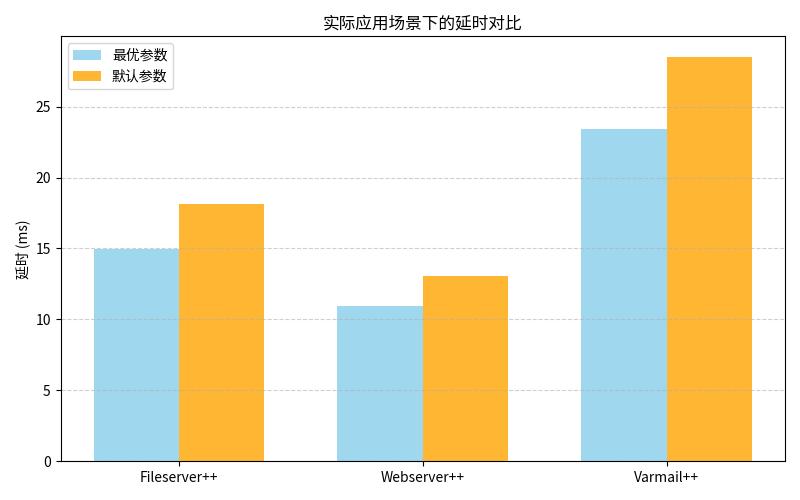

# nfsdig性能调优模块测试
## 1.性能调优模块测试概述
​	参数调优模块的测试点设计及其说明如下：
|测试点|说明|测试结果|
|----|----|----|
|调优性能增益|比较默认参数与调优参数的提升效果|✅吞吐量平均提升**10%**，延时平均降低**25%**|
|场景识别准确性|检验神经网络对NFS不同典型工作负载场景的判别能力|✅准确率**98.5%**|
|调优全流程耗时测试|验证模块是否能快速识别并完成参数调整|✅平均耗时约**0.1s**|
|自动调优系统稳定性|模拟长时间运行环境验证系统稳定性|✅全部通过|
|场景切换综合测试|验证系统能否准确识别快速切换的负载场景|✅全部通过|
## 2. 场景识别准确性测试

### （1）测试概述
​	在实现性能调优模块时，我们根据NFS工作特性，将其工作状态划分为**9个场景**，其中我们筛选出**4个有提升幅度较大的重要场景**（详情参阅：调优性能增益测试），对这些场景都测试出一组**最佳参数**，我们的项目可以自动监控当前NFS工作情况，并自动将其参数调整为最佳状态，以实现NFS性能提升。

​	我们的场景划分依据主要基于三个关键维度：

- I/O 块大小（`bs`）：1M、64k、4k
- 并发线程数（`numjobs`）：32、16、4
- 负载模式统一为混合读写（`rw=readwrite`，`rwmixread=50`）


​	由于我们的项目需要**根据NFS工作状态确定其工作场景**，因此分类准确性是最关键的指标之一。本部分的测试将基于分类准确率展开，测试我们的项目能否准确判断NFS工作场景。


### （2）测试方法

​	代码`train_and_eval.ipynb`的主要目的是 **训练并评估一个用于 NFS（Network File System）场景分类的神经网络模型**。通过训练模型，使其能够根据关键性能指标预测当前系统所处的 NFS 工作场景。整个流程分为数据预处理、模型构建、训练过程和测试评估四个阶段。其完成的任务如下：
- 构建一个深度学习模型 `NFSNet`，用于根据性能指标分类 NFS 负载场景。
- 在训练集上进行有监督学习。
- 在独立测试集上评估分类准确率，验证模型的泛化能力。

​	我们在**3600**条总数据集中随机抽取**600**条作为测试集，同时将测试集中的数据从训练集中删除，保证模型评估与测试的准确性。如果使用训练集评估，会高估模型能力，因为模型已经"见过"这些数据，可能只是记住了答案；而用**独立测试集**评估，才能真实反映模型是否真的学会了识别**场景的规律性**而不是死记硬背。	

​	`	evaluate_model` 函数的主要作用是 **在测试集上评估已训练好的神经网络模型的分类效果**，以衡量模型的泛化能力。下面是该函数的具体工作流程和设计目的说明：

```python
def evaluate_model():
    model.eval()  # 设置为评估模式，禁用 dropout 和 batchnorm 的训练行为
    all_preds = []
    all_labels = []

    with torch.no_grad():  # 关闭自动求导，加快速度并节省显存
        for X_batch, y_batch in test_loader:
            outputs = model(X_batch)                     # 前向传播
            _, preds = torch.max(outputs, 1)            # 取每行最大概率所对应的类别
            all_preds.extend(preds.cpu().numpy())       # 收集预测结果
            all_labels.extend(y_batch.cpu().numpy())    # 收集真实标签

    acc = accuracy_score(all_labels, all_preds)         # 使用 sklearn 计算准确率
    print(f"测试集准确率: {acc:.4f}")
```

​	这段函数的目的是在训练完成后对模型的泛化能力进行评估，也就是判断模型在未见过的数据上是否仍然能做出正确的预测。整个过程体现了机器学习中训练集和测试集分离的基本原则，评估流程如下：

- 调用 `model.eval()` 将模型置于评估模式，确保推理稳定；
- 使用 `torch.no_grad()` 禁用梯度计算，提高推理效率；
- 逐批读取测试数据，使用 `torch.max()` 获取预测类别；
- 将预测结果与真实标签进行比对，通过 `accuracy_score` 计算总体准确率。


### （3）测试结果
​	我们在训练完成后将模型应用于独立的测试集，并最终得到 **98.5% 的准确率**。该指标表示：在测试集中，98.5% 的样本被正确地分类为其所属的 NFS 工作场景：

$$
\text{Accuracy} = \frac{\text{预测正确的样本数}}{\text{测试集样本总数}} \times 100\% = 98.5\%
$$

这是对模型泛化能力的重要量化评价。


​	经过测试，可以得出我们的模型具有以下特性：
- **泛化能力强**  
   测试集是模型从未见过的数据，因此 98.5% 的准确率说明模型不仅在训练数据上表现良好，也成功学习到了不同 NFS 场景的**性能指标模式**，而非简单记忆。

- **分类器实用性强**  
   98.5% 的精度足以用于生产部署，能够**有效识别实时场景类型**，为后续配置优化提供前提。

- **多场景下的稳定表现**  
   本任务面对的是 **复杂工作场景**，涉及不同 I/O 并发、块大小和负载模式。98.5% 的分类准确率说明模型能够处理这类场景间的复杂边界。

## 3. 调优性能增益测试
### （1）测试概述

​	NFS性能测试主要完成两个核心测试任务：**默认参数配置下的 NFS 性能测试** 和 通过搜索 **测试不同参数配置下的NFS性能** ，以找到该场景下的最佳配置。

​	`	run_default_config()`函数使用**默认挂载参数（即挂载时不指定任何参数）**对 NFS 文件系统进行一次性能评估，测量其吞吐量`（bw）`和平均延迟`（lat_ms）`，并基于以下评分公式计算其综合性能得分：
$$
Score = Throughput−α⋅Latency
$$
其中，$α$ 为延迟惩罚系数，用于平衡吞吐与延迟的重要性。

``` python
res = gp_minimize(
    func=objective,
    dimensions=dimensions,
    acq_func="EI",
    n_calls=40,
    n_random_starts=10,
    random_state=42
)
```
​	上述代码使用 `scikit-optimize` 提供的贝叶斯优化算法 `gp_minimize`，在高维参数空间中进行 40 次尝试（其中前 10 次为随机搜索），目标是**最大化性能函数**，通过动态试探参数组合，最终找到使 `Score` 最大的挂载参数配置。

​	由于NFS 有大量可调参数，如 `rsize`、`wsize`、`actimeo` 等，这些参数对性能有显著影响。然而，默认参数在所有工作场景下并非最优：

- 默认配置是**通用而非最优**的；
- 每种 NFS 工作场景对参数的响应不同；
- 直接暴力搜索成本过高，需要**智能搜索策略**。

​	因此，使用默认参数作为**基准测试**，再通过贝叶斯优化搜索最优配置，可以有效比较并验证**自动调优**的价值。

​	本项目通过比较 **默认配置与自动优化配置** 的性能得分，验证参数调优对 NFS 性能的提升效果。结合吞吐量和延迟构建综合得分指标，并通过贝叶斯优化在参数空间中高效搜索，使调优过程兼顾效率与性能，是实现自动化 NFS 优化的关键环节。

### （2）测试方法

​	在 NFS 参数调优与性能测试过程中，**`fio`（Flexible I/O Tester）** 被广泛采用作为测试工具。本项目同样选择 `fio` 来模拟真实的负载场景，并采集关键性能数据。

​	[`fio`](https://github.com/axboe/fio) 是一个强大的 I/O 测试工具，能够灵活模拟各种 I/O 模式，包括：

- 顺序读/写、随机读/写、混合读写（如 `--rw=readwrite`）；
- 多线程并发（如 `--numjobs=32`）；
- 块大小、文件大小、测试时间等高度可定制；
- 支持 JSON 输出，便于自动化分析；
- 可作用于本地文件系统、块设备、网络挂载（如 NFS）等。

​	在 NFS 挂载参数优化任务中，我们的目标是**评估和提升在不同参数配置下 NFS 的实际性能表现**。使用 `fio` 可以在受控环境下，模拟稳定、可复现的负载，便于我们对比不同配置的效果。具体测试指标包括：

- **吞吐量（Throughput）**：表示单位时间内完成的数据传输量（KB/s），衡量带宽利用率；
- **平均延迟（Latency）**：表示每个 I/O 请求的响应时间，衡量系统响应能力。

​	在本项目中，`fio` 被用于：

- 对每一组 NFS 挂载参数组合进行**标准化性能测试**；
- 统一采用混合读写 (`--rw=readwrite`) 模式，匹配典型工作场景；
- 固定运行时间 (`--runtime=40`) 保证测试公平性；
- 利用 `--output-format=json` 获取结构化输出，供模型分析与优化目标函数使用。
> 采用 `fio` 作为 NFS 性能测试工具，具有高度可配置性、结果可信、适配自动化优化流程等诸多优势。它是连接挂载配置与性能反馈之间的桥梁，是整个参数调优流程的基础支撑工具。
### （3）测试结果
#### ①自定义场景

在自定义场景中，我们一共运行了9组测试，分别对应9种不同场景，其中场景定义如下：

| 场景编号 | 块大小（bs） | 并发线程数（numjobs） | 文件大小（size） | 场景描述                |
| -------- | ------------ | --------------------- | ---------------- | ----------------------- |
| 1        | 1M           | 32                    | 128M             | 高并发 + 大块混合读写   |
| 2        | 1M           | 16                    | 128M             | 中等并发 + 大块混合读写 |
| 3        | 1M           | 4                     | 128M             | 低并发 + 大块混合读写   |
| 4        | 64k          | 32                    | 8M               | 高并发 + 中块混合读写   |
| 5        | 64k          | 16                    | 8M               | 中等并发 + 中块混合读写 |
| 6        | 64k          | 4                     | 8M               | 低并发 + 中块混合读写   |
| 7        | 4k           | 32                    | 512k             | 高并发 + 小块混合读写   |
| 8        | 4k           | 16                    | 512k             | 中等并发 + 小块混合读写 |
| 9        | 4k           | 4                     | 512k             | 低并发 + 小块混合读写   |

上述场景对应最优的搜索参数与默认参数的延时和吞吐量对比如下图所示：
|场景编号|最优参数吞吐量(KB/s)|搜索参数延时(ms)|默认参数吞吐量(KB/s)|默认参数延时(ms)|
|-------------|------------------|-----------------|-----------------|-----------------|
|1|**335492**|**13.98**|291388|50.27|
|2|**312431**|**3.34**|279254|5.33|
|3|**240554**|**1.39**|238103|1.67|
|4|**79099**|**6.39**|66796|12.18|
|5|**67510**|**2.88**|60775|4.22|
|6|**38148**|**0.48**|39610|0.50|
|7|**6081**|**11.73**|5975|9.23|
|8|**5578**|**3.16**|5453|3.14|
|9|**2791**|**0.32**|2745|0.31|


> 分析：在部分高负载场景中，如场景1和2、场景4和5，我们搜索得到的最优参数相较于默认参数提升幅度明显，而在其他场景中，调优后的结果相较于默认参数提升幅度较小。由于参数调优需要执行挂载(mount)和卸载(umount)等操作，会消耗一定的系统资源，因此我们认为在提升较小的场景中可以直接选择使用默认参数，在负载较大的场景中才使用我们调整后的参数。

#### ②高负载场景
​	我们对调整参数后**性能提升较大**的场景定义如下：
- **BTEC**(Bulk Transfer under Extreme Concurrency)：**超高并发下的大容量数据传输**，适用于如视频渲染等吞吐导向型任务。
- **BTHC**(Bulk Transfer under High Concurrency)：**高并发的大容量数据传输**，适用于科学计算或文件处理中的常规批量数据访问。
- **FAEC**(Frequent Access under Extreme Concurrency)：**超高并发下的小块频繁访问**，代表如数据库、缓存系统等高IOPS需求负载。
- **FAHC**(Frequent Access under High Concurrency)：**高并发下的小块访问模式**，适用于多用户共享目录读写、系统级日志等场景。

​	在上述这些场景中，经过我们的参数调整，吞吐量取得了较大提升，延时也有了明显降低：

  
  

| 场景 | 吞吐量平均提升 | 延时平均降低 |
| ---- | -------------- | ------------ |
| **BTEC** |    **15.1%**     |     **72.2%**   |
| **BTHC** |    **11.8%**        |     **37.3%**   |
| **FAEC** |    **18.4%**        |     **47.5%**   |
| **FAHC** |    **11.0%**        |     **31.7%**   |

以BTEC场景为例，该场景为高并发高负载场景，相较于默认参数，我们修改的参数主要为：
|参数|默认值|调优值|分析|
|---|---|---|---|
|wsize|1048576|131072|写块小于默认值，有助于减少大块写入对 I/O 队列的堵塞风险，适合高并发下分批处理，有助于提升整体调度效率|
|timeo|600|100|请求超时阈值大幅降低，使错误或丢包处理更及时，缩短等待时间，大幅降低平均延迟|
|actimeo|	默认系统设定|5|文件属性缓存生存时间显著降低，有助于提升并发一致性，避免访问旧数据，但略增元数据I/O，适合写密集/高并发环境|
|acregmin/max, acdirmin/max|未配置（默认长时间缓存）|缩短至3~60秒|减少目录和文件属性缓存时间，提高一致性保障，提升高频访问或元数据变动下的效率|

> 在我们的测试数据中，延时显著降低而吞吐量仅小幅提升，主要原因是二者并非线性或反比例关系。延时衡量的是单次操作的响应速度，而吞吐量反映的是单位时间内完成的总数据量。在系统接近硬件瓶颈（如网络或磁盘带宽）时，即使通过参数优化显著减少了排队等待、提升了I/O响应效率，延时可大幅下降，但整体吞吐量的提升会受到系统资源上限的制约。因此，延时改善反映了微观性能优化效果，而吞吐量变化则取决于宏观资源利用情况。

#### ③实际应用场景

为进一步验证所调参数在**非合成场景**下的泛化能力，我们在实际 NFS 应用场景中测试了由 **filebench** `(https://github.com/filebench)`提供的三种典型工作负载Fileserver、Webserver和Varmail，并在其基础上增加了负载压力，使用前述高负载场景中获得的**统一调优配置**进行评估：

- **Fileserver++**：文件服务器是典型的**混合型负载**，包含用户交互下的文件浏览、编辑、批量复制、存档等操作。
- **Webserver++**：Web服务器场景主要以**高频只读**为主（如读取 HTML、图片等静态文件），访问文件小而频繁。
- **Varmail++**：邮件服务器目录常被用于存储用户邮件，具有大量**小文件混合读写**的特点。

  
  

| 场景 | 吞吐量平均提升 | 延时平均降低|
| ---- | -------------- | ------------ |
| **Fileserver++** |    **13.6%**        |     **17.3%**   |
| **Webserver++** |    **10.7%**       |     **15.8%**   |
| **Varmail++** |    **12.8%**        |     **18.0%**   |

尽管上述三类应用并未参与调优过程，但**通用调优配置**依然带来了较大性能提升。这充分说明：我们提出的调优策略具备良好的**泛化能力**与**可移植性**，不仅适用于典型高负载测试场景，也适合在实际生产环境中推广应用。

#### ④总结

​	经过上述测试，我们对结果总结如下：

- **吞吐量**的提升说明了系统在单位时间内能完成更多的数据传输任务，表明我们通过参数优化提升了网络栈及 I/O 的利用效率。特别是在高并发或大数据块的场景中，合理设置 `rsize/wsize`、`threads` 等参数可有效避免瓶颈，减少上下文切换及 RPC 调用开销。
- **延时**的大幅降低，表明客户端在访问远端 NFS 服务时的响应时间显著改善。延迟降低常常意味着更好的交互体验和更快的事务响应，特别适用于在线事务处理系统（OLTP）或小文件密集型访问。

​	我们优化的核心点在于：
- 动态识别场景负载特征（通过**分类器**识别场景）
- 针对每种场景设定最佳参数（通过**贝叶斯优化**进行搜索）
- 平衡**吞吐量**与**延迟**之间的权衡（引入延迟惩罚因子进行综合得分计算）

​	默认参数虽然具有较好的通用性，但远不能适应所有工作负载。通过参数调优，我们可在目标场景下获得更优的性能表现。这一结果也验证了自动化配置优化机制在 NFS 系统中的有效性与必要性。

## 4.参数调优全流程耗时测试

### （1）测试概述	

​	参数调优全流程包括识别场景，读取参数，最后通过mount和remount进行参数调整。本部分测试的目的是测试参数调优系统能否在较短时间内识别场景并将NFS参数调整为最佳，以满足部分实时性较高的场景的要求。

### （2）测试方法	

​	我们对100次**调优全流程**（包括NFS高负载场景）的耗时进行了记录与分析，测试方法为在参数调优模块执行前后分别调用`time.time()`函数读取当前时间，二者作差即为耗时。

### （3）测试结果

  

​	对上述测试结果的分析：

- nfsdig参数调优全流程（从读取监控文件到参数优化完成）**耗时最长约为0.15s**，**平均耗时约为0.1s**；
- 当两次识别到同一个场景时，第二次无需重新执行挂载操作，此时耗时约为0；
- 综上，nfsdig参数调优模块具有**实时快速高效**的特点，远优于传统的手动调整方式。

## 5. 调优系统稳定性测试

### （1）测试概述

​	为验证参数调优系统在实际部署环境中的**稳定性与鲁棒性**，我们从两个维度进行了系统性测试：长时间运行稳定性测试与高压负载边界测试。

- 长时间运行稳定性测试旨在检验系统在**长时间连续运行**过程中是否存在崩溃、卡顿、资源泄漏等问题。我们在典型负载场景下持续运行系统超过 **8 小时**，在此过程中系统持续完成采集、分类与自动调优任务。

- 高压负载边界测试旨在进一步验证系统在极端负载条件下的稳定性，我们基于 [Filebench](https://github.com/filebench) 工具构造了三个典型 NFS 负载场景的高压版本：

  - **Fileserver++**：模拟高并发文件操作

  - **Webserver++**：模拟网页资源频繁请求与更新

  - **Varmail++**：模拟密集邮件收发行为

这些场景在标准配置基础上**增强负载压力**，逼近测试主机的资源极限。

### （2）测试方法
#### ①长时间运行稳定性测试

​	为评估参数调优系统在真实场景下的持续运行稳定性与鲁棒性，本测试设计了一套基于周期性采集、分类与调优任务的长时间连续运行测试方法。其核心目的是验证系统在无人值守条件下是否具备长期正常工作能力，即：

- 不出现崩溃或异常中止；

- 系统资源保持在合理使用范围；

- 识别与调优准确性长期稳定；
- 参数调整**行为正常可追踪**。

本测试将整个调优流程嵌入一个**周期性执行的自动循环**，并进行如下设计：

1. **定时执行机制**
    系统按照固定时间间隔（如每60秒）读取新采集的指标数据进行处理，模拟真实系统的在线调优过程。
2. **实时场景识别与判断**
    使用训练好的分类器对采集到的系统指标进行场景判断，识别系统当前运行模式。
3. **参数更新触发机制**
    如果识别出的场景与前一次不一致，则系统立即切换对应的NFS优化参数，并重新挂载；若场景未变化，则跳过调优以节省资源。
4. **日志与统计记录**
    每次分类结果、调优耗时、准确性、是否需要挂载更新等信息都会被**记录到CSV文件**中，用于生成运行趋势图（如准确率曲线）和后续性能分析。
5. **连续运行观察窗口**
    整个流程不设定提前结束条件，确保系统可持续运行**长达数小时甚至更久**，模拟生产环境中的真实持续运行需求。

**成果指标**

- 分类准确率曲线：持续记录分类总次数与准确次数，计算准确率趋势，评估识别稳定性。

- 调优响应日志：记录每一次触发参数切换的耗时与是否成功，验证系统响应效率。

- 系统行为可追踪性：所有过程自动输出日志，可用于后续可视化分析和调优质量评估。

  

#### ②高压负载边界测试

​	在本项测试中，我们需要测试在主机资源极限条件下，参数调优系统是否仍保持可用性。

​	我们的测试项目基于**filebench**`(https://github.com/filebench)`的三种NFS常见的实际应用场景，包括Fileserver、Webserver和Varmail，并且在其基础上**增加了负载压力**，使得其负载接近于我们测试主机的极限。

​	其中**Fileserver++**、**Webserver++** 和 **Varmail++** 分别表示 Fileserver 、 Webserver 和 Varmail 的增强版本，在原有测试的基础上增加了测试压力。

​	例如，我们修改后的Fileserver++测试脚本如下：

 

#### ③场景高频切换测试

​	运行我们的监控工具，依次通过fio命令模拟场景，无需人工干预，旨在检测我们的系统能否在快速切换的场景中准确识别，并带来一定的性能提升。分别监控默认参数和调优参数下的吞吐量，记录并以表格形式展现。

### （3）测试结果

#### ①长时间运行稳定性测试
​	我们检验了参数调优系统在长时间连续采集、分类以及调优过程中是否存在崩溃、卡顿等问题，总测试运行时长约为**8小时**。
  
​	分析折线图可知，我们的参数调优系统在长时间运行下也拥有高准确率，拥有较强的稳定性与可靠性。

#### ②高压负载边界测试

  

 |场景|调优全流程耗时|准确性|
|--------|-------|-------|
|**Fileserver++**|1.254s|✅准确识别并调整参数|
|**Webserver++**|0.722s|✅准确识别并调整参数|
|**Varmail++**|1.645s|✅准确识别并调整参数|


​	在持续增加测试压力的情况下，虽然由于系统资源限制，耗时有所增加，但我们的参数调优系统仍然能保持正常工作状态，并准确识别上述高压负载场景，足以证明其在高压环境下的适用性。

​	经过多维度稳定性测试，我们验证了系统在长期运行、高压负载等情况下依然能够保持分类准确、参数切换及时，且系统资源使用稳定，调优结果具备良好的一致性和鲁棒性，体现了nfsdig系统的工程可靠性和实用价值。

#### ③场景切换综合测试

为了评估我们系统在**负载快速变化环境**中的场景识别能力与参数自适应能力，我们设计了一组包含多种典型 NFS 负载的实验。实验通过 `fio` 工具模拟四种典型的 NFS 场景，涵盖了从高负载到低负载的全过程。系统需在运行时**自动识别场景变换并完成参数重配置**，以提升吞吐量表现。每种场景运行时间约 4~6 分钟，总测试时间为 20 分钟，期间不允许人工干预。

我们记录了每个阶段的**默认参数配置下的吞吐量**与**调优参数配置**下的吞吐量，结果如图所示：

  


分析折线图可知，我们的调优效果显著。在前两种负载中，调优后系统的吞吐量显著高于默认配置，最大提升超过 10%，显示出系统在高负载与中等负载下的有效优化能力。我们的系统不仅能够实现自动场景感知与参数优化，还能在多变的工作条件下持续保障系统性能，为构建智能化的 NFS 存储系统提供了有效支撑。

上述结果充分说明 nfsdig 不仅具备强大的性能优化能力，更是一套可靠性成熟、可落地部署的 NFS 智能调优系统。