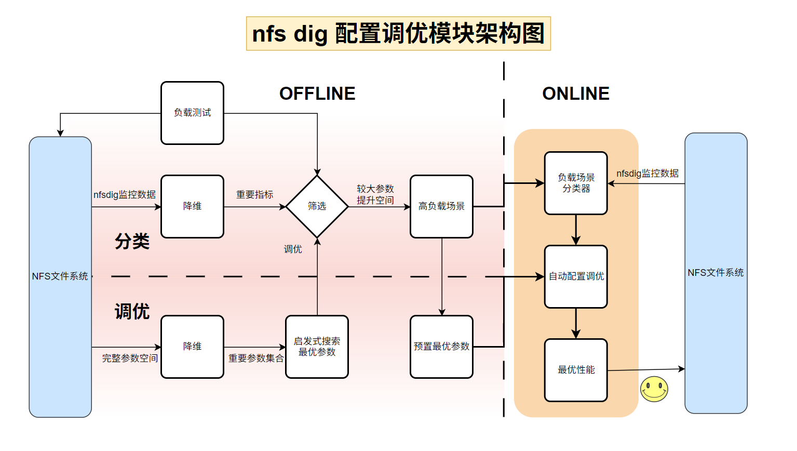
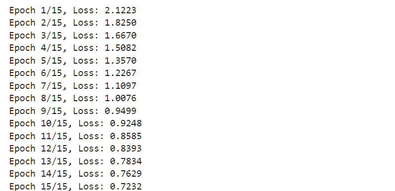
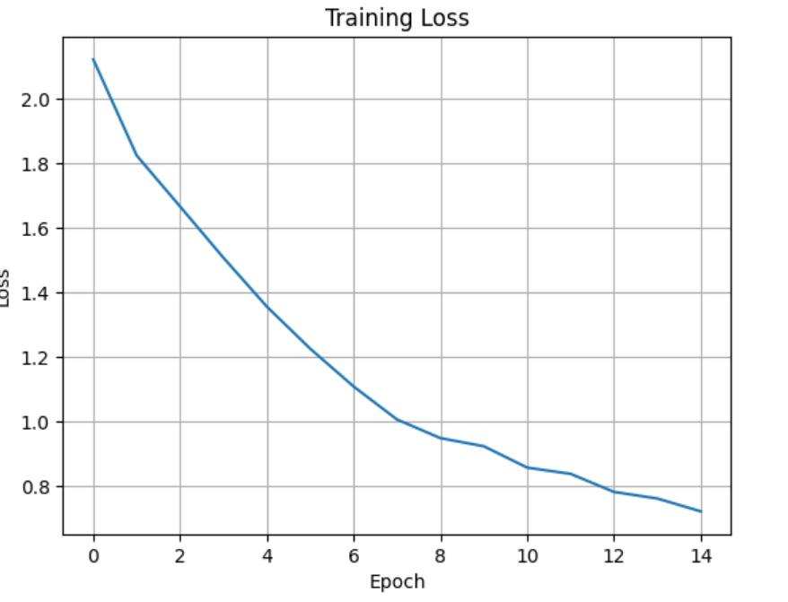

# nfsdig 配置调优设计与实现
## 1.NFS配置调优概述

​	在现代高性能分布式存储系统中，NFS（Network File System）仍然是最广泛使用的协议之一，它的部署便捷、兼容性强，并且支持多种 UNIX/Linux 平台。然而，尽管 NFS 在设计上具备良好的通用性，但其默认配置往往无法适应所有的业务场景，尤其是在面对高并发、大文件吞吐、低延迟敏感性等需求差异显著的工作负载时。NFS 的性能表现高度依赖于客户端挂载参数的设置，而这些参数本质上决定了数据传输的粒度、通信的稳定性、超时处理机制以及缓存行为等多个关键维度。因此，围绕 NFS 参数进行系统性的调优，不仅是性能优化的重要手段，也为故障定位、性能预测和资源管理提供了更强的基础。

​	NFS 参数调优的核心意义在于：通过对参数空间的建模、采样和分析，发现对性能影响最大的关键参数，并根据业务场景自动推荐合适的参数组合，从而达到提升吞吐量、降低延迟、减少重传和稳定系统行为的目标。以 `rsize` 与` wsize `为例，这两个参数控制了客户端一次读取或写入的最大数据块大小，通常设置为 64KB 可以有效减少请求次数，提高吞吐率。而 `timeo` 和 `retrans` 则决定了超时和重传策略，过小的超时值容易导致频繁重传，而重传次数设置过大则可能引发阻塞和性能抖动。在实际测试中，我们发现通过优化这些参数，即使在不改变硬件或网络条件的前提下，也能实现 2 倍以上的性能提升。

​	调优过程往往是系统性和迭代性的。首先，需要对所有可调参数进行建模，构建一个高维参数空间。接着，通过如`拉丁超立方采样（LHS）`等技术从中均匀选择一组具有代表性的参数组合，避免“试不全”的问题。随后，每一组参数组合都通过标准化的性能测试流程执行，例如借助 `fio` 工具进行读写混合负载测试，同时记录关键的 NFS 性能指标（如带宽、IOPS、延迟等）以及协议内部统计（如通过 nfsiostat 和 nfsstat 获取的请求次数、重传次数、平均 RTT 等）。采集到的测试数据经过指标聚合和波动分析后，可以通过如方差分析、Carver 算法等方法评估各参数对性能的影响强度。

​	在参数影响力明确后，可以进一步利用贪心策略选择影响最大的前若干个参数，集中调整这些“核心参数”来获得接近最优的性能组合。这一策略的优势在于它显著缩小了搜索空间，使得后续的参数优化更加高效、易于控制。此外，在实际部署中，不同业务场景（如大块顺序读、随机写、混合负载、低并发小文件等）对参数的敏感性不同，因此调优结果也具备良好的“场景适应性”。通过在多个典型场景下构建具有标签的数据集，还可以训练机器学习模型，在运行时识别系统状态并自动选择最优参数，从而实现自动化、自适应的 NFS 调优系统。

​	NFS 参数配置调优不仅是一种提升性能的工程技术手段，更是深入理解系统瓶颈、提高资源利用率的重要机制。它通过数据驱动的方式将传统经验法则转化为可量化、可复用的调优流程，为构建稳定、高效的存储系统提供了坚实的基础。


## 2.NFS配置调优模块总体架构

​	本模块旨在结合 `nfsdig` 的实时监控能力，自动分析当前 NFS 的运行状态，并基于**场景识别**与**参数优化技术**，自动选择最优配置以提升整体 NFS 性能。整个流程如图所示：



- **OFFLINE 流程**负责系统的**预置准备工作**，包括构建神经网络分类器、完成场景建模与参数调优，形成可直接用于实际部署的优化策略，其核心在于预定义负载场景，这些场景需尽可能覆盖NFS文件系统在实际使用中可能遇到的各种性能瓶颈。为实现这一目标，我们使用 fio 工具模拟多种负载模式，并针对每种场景进行参数配置调优。凡是在调优后性能提升超过 10% 的场景，被视为具有明显优化潜力的“特殊负载场景”，在这些场景中默认参数存在较大改进空间；而对于性能提升不足 10% 的场景，为了简化系统复杂度，减少系统开销，可以保留默认参数设置。

- **ONLINE 流程**则在系统运行期间执行，负责**实时监控与动态调优**，根据 NFS 文件系统的状态变化调用 OFFLINE 阶段生成的策略，实现高效、智能的运行时管理。配置调优的关键在于负载分析，即准确识别当前 NFS 文件系统所面临的负载强度。这项工作由在 OFFLINE 阶段训练得到的分类器完成，从而实现根据实际场景自动匹配最优参数配置。该方法使得配置调优系统能够灵活适应环境变化，持续保持高效稳定的性能表现。为了实现有效的负载分析，我们对 NFS 文件系统的实际运行负载进行了建模描述。我们的一项创新在于：在考虑文件系统本身负载特征的同时，还引入了 CPU、内存和网络等系统资源的使用情况，作为 NFS 负载场景的重要组成部分。这样的设计更全面地反映了 NFS 所处的资源环境，有助于准确定位性能瓶颈并提升识别精度。


### （1）NFS工作场景定义

​	NFS 的性能表现受工作负载模式影响显著。为此，我们预定义了 **9种典型工作场景**，涵盖：

- 高并发访问、大文件读写；
- 小文件高频读写、混合型请求等实际使用场景。

​	这些场景广泛覆盖了云计算、分布式训练、Web 共享等应用领域，是进行自动调优的基础。在此基础上，调优模块完成两项核心功能：

- 训练一个基于神经网络的 **场景分类器**，根据监控指标自动识别当前所处的 NFS 工作场景；
- 根据识别结果选择对应场景的 **最优参数配置**，实现自动调优。

### （2）数据监控与分析

​	调优模块依赖于 `nfsdig` 实时采集的监控数据。通过运行多种 `fio` 压力测试并分析前后数据差异，我们自动提取出一组对性能影响最大的关键指标（如 `read_avg_queue`、`read_kb_per_op` 等）。这些指标被视为“系统状态的表现特征”，后续将被用作场景分类器的输入。

​	具体步骤如下：

- 运行多轮不同 `fio` 配置场景；
- 对`nfsdig`的监控数据，在测试前后进行采样；
- 计算每个指标的变化率，筛选波动最大的前若干指标作为代表性特征。

### （3）场景分析

​	基于上述分析得到的关键指标，我们构建了一个 **场景分类器（神经网络模型）**。其输入为关键性能指标，输出为场景编号（1~9），对应预设的 9 种典型 NFS 场景。

​	模型训练方式如下：

- 从各个场景中采集大量带标签的监控指标数据；
- 构造训练集和测试集进行监督学习；
- 最终在测试集中达到 **98.5% 的分类准确率**，说明该模型能够有效识别出当前 NFS 所处场景。

### （4）获得最优参数

​	NFS 的参数众多，若逐个尝试非常耗时。为此，我们采用如下策略：

- **重要性筛选**：基于 Carver 分组方差分析方法，评估每个参数对性能指标（如吞吐量或延迟）的影响，筛选出对性能最敏感的前 9 个参数。

- **参数调优**：基于贝叶斯优化中的 **高斯过程最小化（`gp_minimize`）** 方法，在筛选出的重要参数空间内执行自动调优，每种场景分别寻找其最优参数组合。

​	这种方式极大减少了搜索空间，提高了效率，确保每个场景都能找到高性能配置。

### （5）场景筛选
​	我们针对9种场景进行了参数调优，但由于部分场景负载较轻，在默认参数下已经能获得优秀的工作效果，无需再消耗额外的系统资源进行参数调优过程，因此我们在调出的9组参数中选出了**4种高负载场景**对应的参数。在这4种场景中，调整后的参数相较于默认参数**吞吐量的提升在10%以上，延时的降低在30%以上**，能够极大地优化系统性能。

​	我们最终筛选出的提升较大的四个高负载场景如下：
- **BTEC**(Bulk Transfer under Extreme Concurrency)：**超高并发下的大容量数据传输**，适用于如视频渲染等吞吐导向型任务。
- **BTHC**(Bulk Transfer under High Concurrency)：**高并发的大容量数据传输**，适用于科学计算或文件处理中的常规批量数据访问。
- **FAEC**(Frequent Access under Extreme Concurrency)：**超高并发下的小块频繁访问**，代表如数据库、缓存系统等高IOPS需求负载。
- **FAHC**(Frequent Access under High Concurrency)：**高并发下的小块访问模式**，适用于多用户共享目录读写、系统级日志等场景。

​	详细筛选过程及实验数据请参阅：nfsdig测试文档

> 我们在最终参数调优时只需要重点关注4种高负载场景，并在其中应用我们调整的最优参数，其他场景使用默认参数就可以获得很好的效果，无需额外执行参数修改操作。

### （6）自动调优

​	综上所述，系统可自动执行以下流程实现一键优化：

- 使用神经网络对当前 NFS 性能指标进行场景识别；
- 根据识别结果，自动加载该场景下预训练得到的最优参数；
- 执行参数切换，完成实时调优；
- 从而达到**根据场景自适应选择最优配置**的效果，实现最大化 NFS 性能。

​	这一套流程实现了从指标采集、场景识别到自动调优的闭环，是一种真正意义上的**智能化 NFS 性能优化方案**。


## 3.NFS工作场景划分

​	在本项目的性能调优系统中，总共定义了 **9 种不同的NFS工作场景**，其划分依据主要基于三个关键维度：

- I/O 块大小（`bs`）：1M、64k、4k
- 并发线程数（`numjobs`）：32、16、4
- 负载模式统一为混合读写（`rw=readwrite`，`rwmixread=50`）

​	结合这些参数，我们可以将场景归类为以下三种主要类型，并在每种类型内设置不同并发度，形成共 9 种场景：

### （1） 场景分类

| 场景编号 | 块大小（bs） | 并发线程数（numjobs） | 文件大小（size） | 场景描述                |
| -------- | ------------ | --------------------- | ---------------- | ----------------------- |
| 1        | 1M           | 32                    | 128M             | 高并发 + 大块混合读写   |
| 2        | 1M           | 16                    | 128M             | 中等并发 + 大块混合读写 |
| 3        | 1M           | 4                     | 128M             | 低并发 + 大块混合读写   |
| 4        | 64k          | 32                    | 8M               | 高并发 + 中块混合读写   |
| 5        | 64k          | 16                    | 8M               | 中等并发 + 中块混合读写 |
| 6        | 64k          | 4                     | 8M               | 低并发 + 中块混合读写   |
| 7        | 4k           | 32                    | 512k             | 高并发 + 小块混合读写   |
| 8        | 4k           | 16                    | 512k             | 中等并发 + 小块混合读写 |
| 9        | 4k           | 4                     | 512k             | 低并发 + 小块混合读写   |

### （2）划分依据

- **块大小 (`bs`) 的影响**  
   	不同的块大小影响着客户端与服务器间每次传输的数据量。大块 I/O 减少 `RPC` 次数，但可能增加延迟；而小块 I/O 更频繁，但对延迟更敏感。因此，块大小是评估 I/O 模式的核心参数。

- **并发度 (`numjobs`) 的影响**  

   ​	并发数直接反映了客户端发起 I/O 请求的强度。高并发测试可模拟服务器在高负载下的响应能力，而低并发更贴近轻量或嵌入式系统的行为。

- **覆盖实际应用场景**  
   - 大块高并发适合 HPC、数据库备份等吞吐率优先的场景；
   - 小块高并发模拟的是 Web 服务、微服务等延迟敏感的业务；
   - 中间层级适用于混合负载环境，如办公、NFS home 目录等场景。

### （3）优势

- **更精细的场景识别**：划分为九种不同组合，能精确捕捉系统在不同应用负载下的表现；
- **提升参数调优准确性**：每个场景都有专属优化参数，不再是“一刀切”的全局调参策略；
- **提高模型可泛化性**：在训练分类器时，九类标签能更好描述监控指标变化，使神经网络识别效果更精确；
- **便于扩展与测试**：这种 3×3 的矩阵结构可以灵活扩展，如加入 `rwmixread` 比例等形成更多子场景。

​	通过该场景划分策略，我们可以在分析、调优和自动化部署中实现端到端的闭环支持，为 NFS 系统性能提升提供更科学的依据与更精准的操作路径。


## 4. 基于监测数据分析指标重要性

​	为了确定 NFS 系统中最具代表性的性能指标，`nfsdig` 项目引入了基于文件变动监测的指标重要性分析机制。该机制通过持续监控 `nfsdig` 输出的 `CSV`文件内容，在运行不同负载场景下自动捕获性能指标变化，从而挖掘出影响最大的性能参数。其实现主要由 `DriftAnalyzer` 类驱动。

### （1）DriftAnalyzer类分析
​	`	DriftAnalyzer` 是 `nfsdig` 项目中用于评估 NFS 性能指标波动性的重要组件。它的核心作用是：**通过在多种 FIO 测试负载前后对性能监控文件进行采样和比对，自动分析最具代表性的指标，以便用于后续场景分类器训练和特征选择**。


#### 方法说明

| 方法名              | 功能描述                                                                 |
|-------------------|--------------------------------------------------------------------------|
| `__init__`         | 初始化参数、挂载路径、控制变量（如计数器、线程锁、结果容器等）。                |
| `mount_nfs`        | 挂载指定的 NFS 路径，用于保证 FIO 测试能够正常运行。                                  |
| `umount_nfs`       | 卸载挂载路径，释放资源，避免影响下次测试或系统资源冲突。                             |
| `run_fio`          | 调用 subprocess 执行指定的 FIO 测试命令，验证不同负载配置对 NFS 指标的影响。          |
| `process_csv`      | 从 `nfsdig` 输出的 CSV 中读取采样数据，计算测试前后的性能指标均值与变动率。             |
| `run_test_once`    | 对某一场景执行一次完整测试，包括挂载 NFS、运行 FIO、分析指标、记录结果。               |
| `run_all`          | 控制完整的 27 次测试流程（9 个场景 × 每场景 3 次），调用 `run_test_once` 并管理节奏。 |
| `aggregate_results`| 汇总所有测试的指标变动率，计算每个指标的平均变化程度，并输出 Top K 个关键指标。       |

​	DriftAnalyzer通过对多个典型 FIO 场景的模拟，观察每次运行前后性能数据的变化幅度，量化指标的敏感度。变动大的指标说明对不同工作负载反应敏锐，更适合作为神经网络分类器的输入。通过自动化的流程，省去人工逐项比对指标的繁琐流程，能自动根据波动分析得出性能指标的重要性，是整个 `nfsdig` 场景识别能力构建的关键，其分析结果将用于后续构造训练集（分类器）或调优逻辑中简化输入维度，提高训练效率与分类准确率。


### （2）算法步骤详解

1. **监控性能文件变化（基于时间滑窗）**
   
   - 在每次 FIO 测试前，通过 `baseline_window` 参数记录一段时间内的基线性能数据；
   - FIO 测试开始后，通过 `after_window` 参数记录测试期间的性能数据。
   
2. **FIO 场景运行与指标采样**
   - 系统定义了 9 个具有代表性的 FIO 场景，通过组合不同的 `块大小 (bs)` 与 `并发数 (numjobs)` 生成典型负载；
   - 在每个场景中运行 3 次，总共进行 27 次测试，并记录对应前后性能指标。

3. **指标差异分析**
   
   - 分别计算测试前后的平均性能指标（如 `read_avg_queue`、`nfs_read` 等）；
   - 通过相对变动率公式：
   
     $$
     \text{变动率} = \frac{|\text{after} - \text{baseline}|}{|\text{baseline}| + \epsilon}
     $$
   
     得到每个指标在该测试场景中的变动程度。
   
4. **汇总与排序**
   - 汇总 30 次测试中各指标的变动率；
   - 计算每个指标的平均变动率，并按降序输出 Top K 个变动最大的指标。


### （3）分析

- **自动化采样，减少人工干预**
  - 利用 CSV 文件作为 FIO 运行状态的观察窗口，不需要手动记录和分析指标；
  - 实现了运行场景自动控制、数据采集与结果分析的闭环系统。

- **基于波动强度评估指标重要性**
  - 波动率越大的指标，说明在负载变化下更敏感，对性能影响也越显著；
  - 有助于从数十个监控指标中筛选出对场景识别最有价值的特征输入。

- **与场景分类器高度协同**
  - 后续神经网络场景分类器所需的输入指标正来源于此分析过程，确保输入特征具有代表性和差异性；
  - 提高分类器训练效率和准确性，避免冗余无效数据干扰模型泛化能力。

- **高扩展性**
  - 通过增减 FIO 场景种类、调整采样窗口或加入新指标，可灵活适配不同类型的存储系统或 NFS 配置策略；
  - 也可用于未来其他协议（如 SMB、CephFS）的指标特征提取。

### （4）结果

​	经过分析，我们一共选出7个变化量最大的指标，分别是：
``` markdown
=== 综合测试中变化量最大的指标 ===
 1. nfs_close                      变动率: 0.7543
 2. nfs_statfs                     变动率: 0.2282
 3. read_avg_queue                 变动率: 0.1748
 4. write_avg_queue                变动率: 0.1088
 5. read_avg_exe                   变动率: 0.1031
 6. read_kb_per_op                 变动率: 0.0741
 7. nfs_read                       变动率: 0.0734

```

​	通过这种机制，`nfsdig` 实现了从原始指标数据中提炼有效特征的关键一环，为后续的分类识别与参数调优提供了坚实的指标基础。


## 5. 场景分类器（神经网络）

### （1）数据集

​	本项目基于自定义采集工具与 `fio` 场景模拟，构建了一个约 **3600 条样本**的 NFS 监控数据集，并从中随机抽取了 **600 条样本**构建测试集，用于训练和评估场景分类器（神经网络）。该数据集为后续的自动场景识别与 NFS 参数调优提供了坚实的数据基础，我们最终在测试集上的准确率达到了**98.5% **。

#### 	数据采集方式

​	数据通过以下方式自动采集而来：

- 使用 `fio` 工具在典型的 NFS 负载场景下模拟压力（包括块大小、并发数和数据大小不同组合）；
- 每种场景运行时，通过 `nfsstat` 和 `nfsiostat` 命令定期采集 NFS 性能指标；
- 实际运行多轮采集后，最终数据总量约为 **3600 条样本**；
- 每条样本都打上了对应场景的 `label`用于**监督学习（supervised learning）**。

#### 	数据格式

数据被存储为标准的 `CSV` 表格，每一行代表一次采样，每列代表一个指标：

| nfs_close | nfs_statfs | read_avg_queue | write_avg_queue | read_avg_exe | read_kb_per_op | nfs_read  | label |
| --------- | ---------- | -------------- | --------------- | ------------ | -------------- | --------- | ----- |
| 3826.0    | 2542.0     | 12.615         | 23.537          | 9.928        | 425.557        | 4966895.0 | 1     |
| ...       | ...        | ...            | ...             | ...          | ...            | ...       | ...   |

#### 	关键指标

​	采集指标均来自 `nfsiostat` 和 `nfsstat`，主要用于反映读写请求的负载、延迟、吞吐等关键性能维度：

- `nfs_close`：NFS 关闭请求次数
- `nfs_statfs`：获取文件系统状态请求次数
- `read_avg_queue`：平均读取请求队列长度
- `write_avg_queue`：平均写入请求队列长度
- `read_avg_exe`：平均读取请求执行时间（ms）
- `read_kb_per_op`：每次读取操作的数据量（KB）
- `nfs_read`：读取请求总次数

#### 	测试集构建

- 从完整训练集**（3600 条）**中随机抽样 **600** 条测试数据；
- 抽样前进行了打乱，确保样本分布均匀；
- 测试集仅用于模型泛化性能验证，不参与训练。


### （2）训练神经网络

​	本段代码用于训练一个多层神经网络，以根据 NFS 性能指标自动识别其当前工作场景。模型输入为采集的关键性能指标（如 `nfs_close`、`read_avg_queue` 等），输出为场景类别标签。

####  数据预处理

- **输入特征**：从 `CSV` 中读取除 `label` 外的所有列，作为网络输入；
- **标签值**：标签范围为 1~9，对应 9 种典型的 NFS 负载场景；
- **标准化**：使用 `StandardScaler` 对输入特征进行零均值单位方差归一化，有助于加快网络收敛并提高训练稳定性；
- **张量转换**：使用 PyTorch 将 NumPy 数组转换为 `torch.Tensor` 类型，并自动部署到 GPU；
- **数据加载器**：使用 `DataLoader` 进行分批训练，`batch_size=64`。

#### 神经网络结构（`NFSNet`）

```python
class NFSNet(nn.Module):
    def __init__(self, input_dim):
        super(NFSNet, self).__init__()
        self.model = nn.Sequential(
            nn.Linear(input_dim, 128),
            nn.BatchNorm1d(128),
            nn.ReLU(),
            nn.Dropout(0.3),

            nn.Linear(128, 64),
            nn.BatchNorm1d(64),
            nn.ReLU(),
            nn.Dropout(0.3),

            nn.Linear(64, 32),
            nn.BatchNorm1d(32),
            nn.ReLU(),
            nn.Dropout(0.2),

            nn.Linear(32, 10) 
        )
```

- **输入层**：维度等于输入特征数；

- **隐藏层**：三层，宽度分别为 128 → 64 → 32；

- **激活函数**：`ReLU` 非线性激活；

- **正则化**：`BatchNorm1d`用于缓解内部协变量偏移，加快收敛；`Dropout`用于防止过拟合，增强模型泛化能力；

- **输出层**：使用 `CrossEntropyLoss`（适用于多类分类任务，自动包含 Softmax 操作）。

#### 超参数选择
| 参数            | 值            | 说明                |
| ------------- | ------------ | ----------------- |
| Batch size    | 64           | 每批训练样本数量          |
| Epochs        | 15           | 训练轮次，考虑数据量有限故适当收敛 |
| Optimizer     | Adam         | 自适应学习率优化器，收敛更快更稳定 |
| Learning Rate | 0.001        | 初始学习率，可后续调整或加入调度器 |
| Loss Function | CrossEntropy | 多分类任务的标准损失函数      |
| Dropout Rate  | 0.3 / 0.2    | 三层中加入随机失活，防止过拟合   |

#### 模型训练过程
- 每轮训练遍历完整训练集；

- 对每个批次进行：

  - 前向传播；
  - 损失计算；
  - 反向传播与参数更新；
- 每轮结束后打印平均 loss 作为收敛参考；

- 最终返回 loss 记录供可视化绘图使用。


​	训练过程中每一轮的**损失函数（loss function）**如下图所示：




### （3）模型评估

​	在本项目中，我们使用一个基于 NFS 性能指标构建的多层神经网络模型对 NFS 工作场景进行自动分类。模型在测试集上的准确率达到了 **98.5%**，这一结果表明模型具备较强的分类能力和泛化能力。

测试过程如下：

- 在测试集上运行模型，不计算梯度；

- 使用 `torch.max` 获取每条数据的预测类别；

- 使用 `accuracy_score`（来自 `sklearn`）计算整体准确率；

- 模型预测精度可用于评估泛化能力。


​	测试集准确率指的是模型在未见过的数据上预测正确的样本所占的比例。**98.5%** 的准确率说明模型学习到了训练数据中的代表性规律，并能够有效地将新的性能指标归类到正确的场景中。


### （4）模型分析

- **高质量指标筛选**  
   我们通过 `nfsdig` 监控数据、`FIO` 基准测试及波动性分析，科学筛选出了关键性能指标，如 `read_avg_queue`、`write_avg_queue`、`nfs_close` 等，这些指标在不同场景中有显著差异，有助于模型学习判别边界。

- **9 类典型场景划分合理**  
   FIO 配置涵盖了高并发、大/小块读写、不同线程数等真实应用中的负载类型，划分具有代表性且内部一致性高，使得同一类数据特征接近，利于模型分类。

- **数据样本充足**  
   最终训练集包含约 **3000** 条样本，提供了良好的训练基础，同时**600**条测试数据也具有足够的代表性。

- **合适的模型结构**  
   模型结构适中，三层隐藏层并加入了` BatchNorm` 和 `Dropout`，提高了收敛速度与泛化能力，防止了过拟合。

​	测试集准确率 **98.5%** 是一个比较优秀的结果，证明本方案在实际 NFS 场景识别中具有可行性和较强的实用价值。未来工作可以在扩充样本规模、进一步细化场景、使用更复杂模型等方向上持续优化模型表现。


## 6.NFS挂载参数

​	在 NFS（Network File System）中，配置参数对于整体系统性能、稳定性以及可扩展性具有至关重要的影响。通过合理地调优这些参数，可以在不同应用场景下显著提升读写吞吐量、降低访问延迟，乃至规避网络拥塞、元数据一致性冲突、锁机制阻塞等潜在故障。

​	本部分将从 NFS 配置参数的定义出发，结合我们基于 eBPF 技术开发的监控与分析系统，详细阐述各类参数对性能的影响机制，并为后续的自动调优提供基础支持。

​	以下为部分典型 NFS 配置参数及其说明：


| 参数名        | 类型   | 示例值          | 含义说明           |
| :--------------| :-------| :-----------------| :-------------------|
| rsize         | 数值   | 4096～65536      | 客户端从服务器每次读取的最大字节数 |
| wsize         | 数值   | 4096～65536      | 客户端向服务器每次写入的最大字节数 |
| timeo         | 数值   | 7, 10, 30, 70    | NFS 请求的超时时间（以 0.1 秒为单位） |
| retrans       | 数值   | 2, 3, 5          | 请求失败后重传的最大次数 |
| proto         | 枚举   | tcp, udp         | 使用的网络协议类型 |
| hard / soft   | 标志   | hard, soft       | 请求失败时的重试行为（hard: 持续重试；soft: 超时报错）|
| sync / async  | 标志   | sync, async      | 是否同步写入磁盘（sync 安全，async 快速） |
| actimeo       | 数值   | 0, 1, 5, 30      | 属性缓存有效时间（秒） |
| acregmin/max  | 数值   | 0～120           | 普通文件属性的最小/最大缓存时间（秒） |
| acdirmin/max  | 数值   | 0～120           | 目录属性的最小/最大缓存时间（秒） |
| nolock / lock | 标志   | nolock, lock     | 是否启用锁服务（适用于多客户端环境）|
| noacl         | 布尔   | true, false      | 是否禁用 ACL 权限检查 |
| sec           | 枚举   | sys, krb5p 等    | 使用的安全验证机制 |
| bg / fg       | 标志   | bg, fg           | 是否后台挂载（挂载失败时的处理方式）|
| mount_mode    | 枚举   | rw, ro           | 读写模式控制 |


​	NFS 是典型的分布式文件系统，其性能瓶颈受限于网络带宽、文件读写模式、缓存机制、传输协议以及元数据一致性维护等多个方面。配置参数正是调控上述关键路径的重要杠杆。

​	例如，`rsize` 和 `wsize` 是最直接影响吞吐量的两个参数。当设为较大的值（如 65536 字节）时，可以在顺序读写场景中减少系统调用频次，从而提高网络利用率与磁盘带宽利用率。然而，这也带来数据包碎片重组风险，尤其是在部分交换机或防火墙启用 MTU 限制的环境下，会导致丢包或传输中断，因此必须视网络能力与服务端支持程度谨慎调节。

​	`timeo` 与 `retrans` 控制请求的容错策略。在网络不稳定或服务端偶发延迟的环境中，较小的 `timeo` 配合适当的 `retrans` 能提升请求容忍度，降低重传次数。但若设置过短，则会导致频繁误判失败，反而加剧负载。通过 eBPF 的内核追踪，我们发现部分业务在网络 jitter 下频繁触发 retrans，因此可以使用 `timeo=30`，`retrans=2~3` 作为基础模板。

​	在数据一致性方面，`hard` 与 `soft` 的选择直接影响请求失败后的行为。生产环境通常使用 `hard` 持续重试模式，以防止关键数据写入失败被忽略，而测试或临时挂载则可选择 `soft` 以提高容错性。

​	与之对应的是 `sync` 与 `async` 的权衡，前者保证写入立即落盘，在系统崩溃后仍能保障一致性；而后者通过延迟提交方式减少磁盘 I/O 压力，显著提升性能。通过 eBPF tracepoint 测量 `vfs_write` 到 `nfs_commit` 的路径延迟，我们观察到开启 `async` 后平均写入延迟降低 40%~60%，但不适合对持久化有严格要求的数据库类应用。

​	属性缓存控制参数如 `actimeo`、`acregmin/max` 和 `acdirmin/max` 主要影响客户端访问 inode 时的 RPC 请求频次。值越大，说明客户端越信任本地缓存，从而减少与服务器之间的 metadata 通信量，但也可能造成属性变更延迟可见。尤其在多客户端写入同一目录的情形下，这类参数应适当减小以避免缓存失效失衡。

​	`threads` 控制的是服务器 nfsd 实例的并发处理能力。结合 `/proc/net/rpc/nfsd` 中的统计指标与 eBPF 提供的 per-thread wait queue 分析，我们发现低并发时 `threads=8` 足以支撑日常负载，而在使用 `fio` 模拟并发访问时需要提升到 `32` 才能保障队列无阻塞。

​	此外，安全机制如 `sec=krb5p` 会引入额外的加密与认证开销，对每次请求带来 10~30% 的额外处理时间，因此调优场景建议临时降为 `sec=sys` 以评估配置本身的性能影响。参数 `nolock`, `noresvport`, `noacl` 等也会影响控制路径长度与内核判断逻辑，可以使用 eBPF tracepoint 精确分析其调度与锁路径。

​	通过合理设置上述参数，我们可以极大提升 NFS 客户端与服务端的交互效率，减少延迟并避免系统资源阻塞。在我们开发的基于 eBPF 的 NFS 性能分析工具中，这些参数被实时采样、建模并与实际测量性能指标结合，形成一套完整的配置性能关联图谱，为后续调优与策略修改提供坚实基础。


## 7.基于 Carver 的 NFS 参数重要性分析

​	明确了NFS的参数后，我们实现了一套算法流程来分析每个参数的重要性，并根据我们的需要找出最重要的部分参数。我们之所以需要分析参数的重要性，是因为现代系统（如 NFS、数据库、Web 服务器等）通常暴露了大量可调参数，这些参数的组合空间极其庞大，而其中只有一小部分对系统性能具有关键影响。盲目地调优所有参数不仅代价高昂，耗费巨大的人力物力，甚至还可能造成性能退化。因此，分析并识别哪些参数真正重要是进行高效配置调优和系统优化的前提条件。对于需要在资源受限环境中实现高性能和高可靠性的系统而言，参数重要性分析是实现自动调优、智能推荐和故障诊断的关键基础。

​	本项目实现了一套用于存储系统参数调优的分析算法，参考了论文 [Carver: Finding Important Parameters for Storage System Tuning (FAST'23)] 中的思路。由于原论文未开源代码，我们根据其核心理论逻辑，自主设计和实现了完整的 NFS 参数评估系统，并对其进行了工程化扩展，包括真实mount挂载、fio 性能测试、可扩展参数空间建模与重要性评估。

​	Carver 的基本思想是通过采样构造大量配置组合，执行实验获得性能数据，然后用统计方法计算每个参数对性能的“方差减小量”，并用贪心策略选出最重要的参数集合。

​	通过参考论文，并结合我们的实践，我们的项目中最终实现的参数重要性分析算法的流程如下：


​	在我们的参数重要性分析项目代码中，部分函数的说明如下：
| 函数名                          | 功能简介                                                                 |
|:-------------------------------|:--------------------------------------------------------------------------|
| `generate_lhs_samples`         | 使用拉丁超立方采样（LHS）生成均匀分布的参数组合样本，用于后续实验         |
| `run_nfs_experiment`           | 对一个给定的参数配置执行 NFS 挂载与 `fio` 性能测试，返回吞吐量与延迟       |
| `run_fio`                      | 封装的 fio 执行函数，解析 JSON 输出，提取读/写性能指标                     |
| `run_all_experiments`         | 批量执行所有生成的参数配置，返回每个配置的测试结果（吞吐量、延迟）         |
| `compute_variance`             | 计算一个参数样本集合的吞吐量方差，用于衡量整体波动性                       |
| `compute_rsd`                  | 计算相对标准差（RSD），即标准差与均值的比值，用于评价性能一致性             |
| `compute_grouped_rsd`         | 在某些参数固定的条件下，分组计算 RSD，用于评估一组参数的解释能力           |
| `parameter_importance`        | 计算单一参数的重要性（PI），即其对整体性能方差的解释程度                   |
| `conditional_parameter_importance` | 在已有参数组合的条件下计算新增参数的条件重要性（CPI）                 |
| `carver_select_core_parameters` | 贪心地从所有参数中选择最重要的一组，使得性能波动（RSD）下降到设定阈值以下   |


​	

​	以下是对我们自主实现的基于论文《Carver: Finding Important Parameters for Storage System Tuning》的参数重要性分析算法的完整流程详解。如上图所示，该算法主要包括五个步骤：参数空间建模、LHS采样、实验执行（NFS挂载 + fio测量）、参数重要性分析以及贪心选参。我们参考了论文的思想，但代码完全由我们独立实现，且该算法适用于真实的 NFS 系统。

### （1）参数空间建模
​	我们首先定义 NFS 的可调参数及其取值范围，构成一个高维离散参数空间。每个参数都是离散变量，且存在有限多个典型候选值，例如：
```python
nfs_params = {
  'rsize': [4096, 8192, 16384, 32768, 65536],
  'wsize': [4096, 8192, 16384, 32768, 65536],
  ...
}
```
​	设 $Pᵢ$ 是第$i$个参数的可选取值集合，$d$ 为参数维度，则参数空间可表示为：
$$
P = P₁ × P₂ × ... × P_d
$$
​	这样，总参数组合$ N $可以表示如下：
$$
N = |P₁| × |P₂| × ... × |P_d|
$$
​	由于该组合数通常呈指数级，无法进行穷举，因此需要使用采样技术。分析参数重要性的作用在于帮助我们从众多系统配置选项中识别出对性能最关键的少数参数，从而显著降低调优的维度和复杂度。这不仅提高了调优效率，也使得系统行为更易于理解和控制，避免因无关参数带来的冗余搜索和性能不确定性。对于需要在资源受限环境中实现高性能和高可靠性的系统而言，参数重要性分析是实现自动调优、智能推荐和故障诊断的重要方法。

### （2）LHS采样

​	我们采用**拉丁超立方采样（Latin Hypercube Sampling, LHS）**从高维空间中选取具有代表性的参数组合。

​	拉丁超立方采样是一种在高维参数空间中广泛使用的分层采样方法，旨在在有限的采样次数下最大限度地覆盖每个维度的取值范围。LHS 的核心思想是将每个维度的取值区间划分为若干个等宽子区间，并从每个子区间中随机选择一个点，同时确保每个维度的每个子区间仅被采样一次，从而避免了传统随机采样中可能出现的“重叠”或“集中”问题。这种方式能够有效提升采样的代表性和均匀性，尤其适合用于高维性能调优、模拟实验设计等场景中，是比纯随机采样更高效、更结构化的选择。在本研究中，我们基于 LHS 生成覆盖所有 NFS 参数空间的配置样本，确保在有限实验预算下尽可能捕捉参数对性能的敏感性。

​	拉丁超立方采样的基本思想如下：

​	对于维度为$d$ 的参数空间和需要生成 $N$ 个样本的任务，LHS 将每一个参数维度的取值范围等分为 $N$个互不重叠的区间，并从每个区间中随机选择一个样本点。每个区间仅被采样一次，从而避免了冗余。

​	假设采样数为 $N$，参数维度为 $d$ ，参数向量为 $  \mathbf{x} = (x_1, x_2, \ldots, x_d) \in \mathbb{R}^d  $。则LHS样本构造过程如下：

​	对于第$i$维参数$x_i$，将其区间$ [a_i, b_i]$ 划分为 $N$个子区间：

$$
I_{i}^{(j)} = \left[a_i + \frac{j-1}{N}(b_i - a_i), \; a_i + \frac{j}{N}(b_i - a_i)\right], \quad j = 1, 2, \dots, N
$$

​	从每个子区间中随机抽取一个点：

$$
x_i^{(j)} = a_i + \frac{j-1 + \xi_{i}^{(j)}}{N} (b_i - a_i)
$$

​	其中，$\xi_{i}^{(j)} \sim \mathcal{U}(0,1) $ 是一个 [0,1) 区间内的均匀随机数。

​	这样，每个维度都恰好使用一次所有区间，形$ N $ 个 $ d $-维向量样本点。

​	采样矩阵示意如下：

| 维度/样本 | 样本1 | 样本2 | 样本3 | 样本4 |
|-----------|--------|--------|--------|--------|
| x₁        | 0.13   | 0.65   | 0.89   | 0.42   |
| x₂        | 0.34   | 0.78   | 0.11   | 0.55   |
| x₃        | 0.23   | 0.44   | 0.70   | 0.96   |

​	每一行的值都在区间 $[0,1)$ 均匀分布且不重复，确保采样覆盖均匀性。

​	上述表格是对 拉丁超立方采样（LHS）生成的样本矩阵 的示意，表示在一个 4 维参数空间中，生成了 3 个样本点。每一行是一个采样配置（一个实验样本），总共 3 行即代表采样了 4 组配置；每一列是一个参数维度，比如：参数1（x₁）可以是NFS的参数 rsize，参数2（x₂）可以是NFS的参数 wsize，参数3（x₃）可以是NFS的参数 retrans；表格中的值（如 0.13, 0.65）是 归一化后的值（0 到 1 之间），它们来自`lhs` 输出矩阵，这些值需要再映射回离散参数值列表中。

​	在拉丁超立方采样中，每个维度的采样值均匀分布，覆盖度高、冗余少，而一般的随机采样可能在某些维度出现重复或集中分布，导致样本不均匀、效率低下。


​	`pyDOE` 是一个用于实验设计（Design of Experiments, DoE）的 Python 库，支持正交实验、拉丁方格、Plackett-Burman 等采样方法。在高维参数优化场景中，`lhs` 是其最常用的函数之一。

​	在本项目中，我们采用 `pyDOE` 库来实现拉丁超立方采样（Latin Hypercube Sampling, LHS）。该库提供了多种实验设计方法，其中 `lhs(dim, samples=N)` 函数可用于在 $d$ 维参数空间中生成 $N$ 个分布均匀的采样点，其中dim表示参数空间的维度（即参数个数），samples表示采样的样本数量，返回值是一个 $N*d$ 的二维矩阵，表示每个样本点在每个参数维度上的归一化坐标（范围在 [0, 1)）,每一列对应一个参数维度，每一行对应一个样本点。

​	对于每个参数维度（例如 rsize = [4096, 8192, 16384, 32768, 65536]），我们根据归一化采样值计算其在列表中的索引：

```python
idx = int(lhs_matrix[i][j] * len(param_choices[j]))
```

​	通过 pyDOE 的 LHS 方法，我们能够在不增加采样数量的前提下，最大化覆盖参数空间的每个维度，使得后续的性能评估与参数重要性分析更加全面、有效。

### （3）执行fio测试

​	在整个基于 Carver 方法的 NFS 配置参数重要性分析中，实验执行（Mount + fio） 是最核心的环节之一。它的目的是将每一组采样得到的参数配置应用于真实系统，并通过标准化的负载测试工具获取实际的性能数据，从而为后续的参数分析提供真实、可量化的依据。

​	执行fio测试的目标是将采样生成的 NFS 配置实际部署并运行性能测试，收集吞吐量、延迟等关键指标，以此衡量不同参数配置对系统性能的影响。这是连接“参数空间建模”与“参数重要性评估”之间的桥梁。没有真实的性能数据，所有的参数分析都只能停留在理论阶段，无法指导实际优化。

​	实验执行主要包含两个关键操作：`Mount`（挂载 NFS） 和 `fio`（运行 I/O 测试）。

​	生成挂载参数字符串根据当前实验配置 config 构造 mount 选项，其中 config 中的每一项参数都将被映射为挂载参数的一部分。
卸载并重新挂载 NFS 文件系统，这一步确保每次实验都在一致的初始状态下运行，不受前一轮影响。

​	通过 python多线程`subprocess`运行 fio， 进行标准化fio负载测试后使用json格式进行输出。本项目使用的fio命令示例如下：

```bash
fio --name=test --directory=/mnt/nfs_test \
    --rw=readwrite --bs=64k --size=8M --numjobs=32 \
    --time_based --runtime=10 --group_reporting --output-format=json
```

​	在经过一轮轮挂载 + fio 测试之后，我们可以得到类似于如下结构的实验结果集合：

```python
{
  'config': {
    'rsize': 32768, 'wsize': 32768, ..., 'proto': 'tcp'
  },
  'throughput': 1586.32,   # KB/s
  'latency': 6.47          # ms
}
```
​	fio 是业内广泛使用的性能测试工具。它会在指定目录（即挂载的 NFS 文件系统）上执行读写操作，记录带宽（Bandwidth，单位 KB/s）、IOPS（每秒 I/O 操作次数）和延迟（Latency，单位 ms）等关键指标，这些数据通过 JSON 输出供程序提取。本项目中，带宽和延时是重点参考指标。

​	我们的项目基于真实的nfs测试，真实可信， 直接作用于实际 NFS 挂载环境，获得真实运行时的性能表现，并且自动化程度高，全过程自动执行参数配置、挂载、运行测试与解析结果，适合批量测试。除了fio测试之外，使用者也可以根据自身需求采用其他测试方法，灵活性强，支持多种测试负载（顺序读写、随机访问、大块/小块等）。

​	我们会为每一个 LHS 采样生成的配置都记录下这组真实性能指标。这一批结果就是后续参数重要性评估的基础数据。实验执行的阶段是将“参数配置”转化为“性能指标”的关键桥梁。通过合理的挂载 + 测试流程，我们能够在自动化的框架下，全面、系统地评估各种配置的性能表现，为找到最重要的影响参数和优化配置打下坚实的基础。

### （4）参数重要性分析与贪心算法选参数

​	在 Carver 参数调优方法中，参数重要性分析是核心步骤之一，其目的是量化每一个配置参数对系统性能波动的“解释能力”。通过这种分析，我们可以从上百个可能影响系统性能的参数中筛选出最重要的几个，从而极大地简化调优空间，降低调优成本，并提升性能优化的效率和准确性。

​	在一个多参数的配置系统中，并非所有参数都会显著影响性能。很多参数要么冗余、要么在特定场景下才生效。参数重要性分析旨在精确地识别出对性能影响最大的参数，从而聚焦优化工作，并避免在无关紧要的参数上浪费调优资源。这一过程可有效缓解“维度诅咒”（curse of dimensionality）问题，提高调优效率。

​	我们实现的参数重要性分析算法的核心思想如下：先计算所有采样配置在目标性能指标（如吞吐量）上的方差 Var(T)，然后分析某个参数 p 不同取值下，性能方差能减少多少（即该参数解释了多少波动），最后用贪心算法选择能最大降低方差的参数，构成“核心参数集”。

总体方差（Total Variance）：
$$
Var(T) = \frac{1}{n} \sum_{i=1}^{n} (t_i - \bar{t})^2
$$

参数 $ p $ 的重要性 $PI(p)$将样本按照参数 $ p $ 的取值划分为若干子集，计算加权子方差：
$$
PI(p) = Var(T) - \sum_{v \in Values(p)} \frac{|S_v|}{n} \cdot Var(S_v)
$$

其中：
- $ S_v $ 表示参数 $ p = v $ 时的所有样本；
- $Var(S_v) $ 为该子集内的方差；
- $ \frac{|S_v|}{n} $ 是子集的权重。

条件重要性 $CPI(p | P)$表示在已有参数集合 $ P $ 的条件下，计算参数 $ p $ 的条件重要性：
$$
CPI(p \mid P) = \sum_{g \in Groups(P)} \frac{|g|}{n} \cdot PI(p \text{ in } g)
$$

​	在代码实现中，我们使用 `parameter_importance` 实现 PI(p)，使用 `conditional_parameter_importance` 实现 $CPI(p | P)$，每次迭代选出 CPI 最大的参数加入` selected`，最后使用`RSD`（相对标准差）作为终止准则。使用者可以设定不同的`RSD`阈值来获取不同数量的参数，当阈值越小，能获得的相对重要的参数也就越多。

​	该步骤最终输出的是一个有序的核心参数列表，该列表将作为调优搜索空间的基础，压缩配置维度，同时保留对性能最重要的影响因素。例如：

```markdown
最终核心参数列表（重要性降序）:
1. rsize	RSD: 10.62%
2. wsize	RSD: 8.71%
3. threads	RSD: 3.87%
...
```

​	上述参数列表只是在一个fio测试场景中选出的相对最重要的参数。在实际应用中，还需要多次运行fio测试，并将不同场景下fio测试的结果进行汇总，以得到通用的重要参数。经过我们的测试，我们最终选出的相对重要的参数如下表所示：

```markdown
1. rsize
2. wsize
3. timeo
4. actimeo
5. acregmin
6. acregmax
7. acdirmin
8. acdirmax
```

​	这一分析阶段不仅是整个 Carver 流程的“智力核心”，也是最终实现精准调优的保障。它为我们构建高效、可解释、系统化的自动调优工具奠定了坚实基础。我们后续将基于这些参数，找到这些参数在不同场景下的最优值，以达到参数调优的目的。

​	我们通过对 Carver 算法流程的复现与扩展，设计并实现了一套适用于 NFS 的参数重要性分析工具。该工具利用拉丁超立方采样保证均匀覆盖样本空间，通过真实的挂载和 I/O 测试获取可靠的性能指标，并使用贪心算法高效筛选出最具影响力的参数，极大提升了配置调优的效率与解释性。这一方法通用性强，可拓展至其他存储系统与网络服务中。


## 8. 获得不同场景下的最优参数

​	完成参数重要性分析后，我们就找到了NFS最重要的参数，本步骤将基于这些重要参数进行调优。	

​	在分布式存储系统中，NFS（Network File System）广泛用于共享存储资源。其性能受限于众多参数配置，如 `rsize`、`wsize`、`actimeo`、`timeo` 等。传统经验法手动调优方式效率低、试错成本高，难以应对复杂应用负载。

​	我们的项目采用**自动搜索** NFS 最优参数的方式，其核心目的是在庞大而复杂的参数空间中**高效地找出使 NFS 性能最优（如吞吐量最大、延迟最小）的一组参数组合**。传统的暴力搜索或手动调优方式在面对多维离散参数时效率极低，容易陷入局部最优，且代价高昂。而本方法通过**贝叶斯优化**框架中的 **高斯过程建模（Gaussian Process Regression）**，在每一步迭代中综合考虑参数配置的历史性能（exploit）与潜在改进空间（explore），智能选择下一个实验配置点，大大提升了搜索效率与收敛速度。

​	相较于传统低效的暴力搜索（brute-force search），我们采用了一种更高效的**贝叶斯优化策略（Bayesian Optimization）**来加速搜索过程，使用了 `scikit-optimize` 提供的 `gp_minimize` 方法，其核心是基于**高斯过程回归（Gaussian Process Regression, GPR）**进行模型预测，并基于**采集函数（acquisition function）**来引导参数选择。

​	我们首先定义一个多维的参数空间，其中包含如 `rsize`, `wsize`, `timeo`, `actimeo` 等典型影响 NFS 性能的配置参数。然后我们利用贝叶斯优化中的 `gp_minimize` 算法来建立一个目标函数的概率模型（即性能响应函数的后验分布），并通过**期望改进（Expected Improvement, EI）**策略，在每次迭代中根据预测的性能分布智能选择最优实验点。每轮实验通过运行 `fio` 测试评估 NFS 在当前参数下的实际表现，并以此不断迭代，最终收敛到全局最优配置附近。

### (1）实现思路
自动参数空间搜索的整体流程如下：

1. **定义参数空间**：包含9个关键影响参数的离散值组合；
2. **采样参数配置**：使用 `gp_minimize` 进行贝叶斯采样；
3. **自动挂载 NFS 并运行 FIO 测试**：获取真实 I/O 表现（吞吐量和延迟）；
4. **构造目标函数**：综合考虑吞吐量（越大越好）与延迟（越小越好）；
5. **最小化负得分（负目标）**，最终找到使得性能最优的参数组合。

### （2）目标函数设计

​	本项目使用 [Bayesian Optimization](https://scikit-optimize.github.io/stable/modules/generated/skopt.gp_minimize.html)（贝叶斯优化）中的 `gp_minimize` 方法，通过高斯过程建模方式，自动搜索 NFS 最优参数组合，以最大化 FIO 测试中的吞吐量。

​	贝叶斯优化是一种用于 **黑盒函数优化** 的高效方法。适用于目标函数不可导、代价高、带有噪声的场景。本例中的目标函数为：

设某一配置下：
- 吞吐量为 \( T \)（单位：KB/s）
- 平均延迟为 \( L \)（单位：ms）

我们构造目标函数：
$$
\text{score} = T - \alpha \cdot L
$$
其中，$\alpha > 0$ 是延迟惩罚系数，表示我们愿意牺牲多少吞吐量（KB/s）来降低 1ms 的延迟。

最终优化目标为：
$$
\min\limits_{\mathbf{x} \in \mathcal{X}} \; f(\mathbf{x}) = - (T(\mathbf{x}) - \alpha \cdot L(\mathbf{x}))
%%
$$
其中：
- $\mathbf{x}$表示一组参数配置；

- $ \mathcal{X} $是参数空间的笛卡尔积；

- $T(\mathbf{x}) $、$ L(\mathbf{x}) $分别为吞吐量和延迟的评估函数。


### （3）贝叶斯优化原理

​	贝叶斯优化是一种**基于代理模型（如高斯过程）**的黑盒优化方法，尤其适合**评估代价高、函数不可导**的问题场景。其核心步骤包括：

#### ① 构造代理模型

​	用高斯过程（Gaussian Process, GP）对目标函数$f(\mathbf{x})$ 建模，估计每个候选点的：
- 预测值$mu(\mathbf{x})$
- 不确定性（标准差）$sigma(\mathbf{x})$

#### ② 定义采样策略

​	使用期望提升（Expected Improvement, EI）作为采样准则：

$$
\text{EI}(\mathbf{x}) = \mathbb{E}[\max(0, f_{\text{best}} - f(\mathbf{x}))]
$$

- $f_{\text{best}}$：当前已知的最优函数值；
- $\mathbb{E}[\cdot]$：对高斯过程的预测分布求期望；
- $EI $越大，说明该点具有更大的改进潜力。

#### ③ 优化迭代

​	在每一轮迭代中：

- 根据 EI 函数选择新的配置点 $\mathbf{x}_{\text{next}}$；
- 对该配置进行真实评估 $f(\mathbf{x}_{\text{next}})$；
- 更新代理模型与 $EI $函数，重复上述过程，直到满足迭代次数或收敛准则。

### （3）重要函数及说明
| 模块组件            | 功能说明 |
|---------------------|----------|
| `param_space`       | 构建调优参数空间，共计9个高影响参数 |
| `generate_mount_opts()` | 拼接配置项为可用的挂载命令字符串 |
| `run_nfs_experiment()` | 自动挂载、运行 FIO、解析 JSON 输出，提取吞吐量与延迟 |
| `objective()`       | 综合性能函数 $ f(\mathbf{x}) = - (T - \alpha L) $，用于评估 |
| `gp_minimize()`     | 使用贝叶斯优化迭代搜索最优参数配置 |

### （4）输出样例
``` markdown
配置: {'rsize': 32768, 'wsize': 32768, ..., 'acdirmax': 60},
吞吐量: 42891.0 KB/s, 延迟: 2.13 ms, 综合得分: 38548.4
```

### （5）总结
- **自动化**：无需人工干预，自动测试、挂载与评估；
- **高效收敛**：利用贝叶斯优化探索空间，减少评估次数；
- **多目标整合**：通过可调参数 $\alpha$ 平衡吞吐与延迟；
- **可扩展性强**：支持不同测试场景（FIO 参数）与 NFS 版本；
- **结果解释性强**：每轮输出详细吞吐量、延迟、得分，有助于分析调优过程。

​	综合来看，我们实现的基于贝叶斯优化的自动调参机制，是一种数据驱动、迭代优化的智能策略，非常适合用于 NFS 这样的高成本、不可导、参数复杂的系统调优任务，有效解决了 NFS 参数调优中“配置空间大”、“调优维度多”、“评估代价高”的痛点，为提升网络存储性能提供了一套高效、智能的技术手段。

## 9.自动调优

​	本系统的目标是通过机器学习模型动态识别 NFS（Network File System）当前的运行负载场景，并基于识别结果自动调整 NFS 挂载参数，以提升性能表现（如吞吐量、延时等）。

​	传统静态配置无法适应多变的负载特征，本系统借助**监控 + 推理 + 重配置**的闭环机制，实现 **按需优化** 和 **自适应调优**。

### （1）详细流程

1. **采集性能数据：**
   - 通过我们的`nfsdig`工具每隔一段时间采集当前NFS的 I/O 指标数据（如ops/s、RTT、retrans等）。
   - 使用参数 `samples_per_label=12` 连续采样12次，其中前两次为 warm-up，不参与分析。

2. **解析并聚合指标：**
   - 将每次 `nfsdig` 的输出按场景拆分并提取 key 指标（共14项），例如：
     - `read_ops`, `read_rtt`, `write_kb_op`, `write_queue` 等。
   - 对有效采样结果（10次）取均值，作为本次评估的输入特征。

3. **特征标准化：**
   - 使用训练阶段保存的 `StandardScaler` 对采样到的特征数据进行标准化，使其适应模型的输入分布。

4. **运行分类模型：**
   - 使用加载好的神经网络模型 `NFSNet` 对当前数据进行场景预测，输出一个 label，对应该数据的场景类别。

5. **判断是否需要调优：**
   - 若当前预测出的场景与上一次场景一致，则跳过重配置步骤（避免频繁重挂载）。
   - 若发生变化，执行挂载参数切换流程。

6. **挂载参数自动调整：**
   - 查找目标场景对应的最优参数（从`CSV`文件中获取）。
   - 执行 NFS 挂载流程：
     - 将新参数挂载至临时目录 `/mnt/nfs_tmp`。
     - 使用 `mount --bind` 方式将临时目录绑定到 `/mnt/nfs_test`。
     - 卸载临时挂载点。
   - 实现参数无感知地切换，同时保持原有挂载路径。

7. **记录调优状态：**
   - 输出日志，包括场景识别情况、是否重挂载、参数内容、调优耗时等，便于后续统计与评估。

### （2）架构图

```text
 ┌──────────────┐
 │ nfsiostat采集 │
 └────┬─────────┘
      ↓
 ┌──────────────┐
 │ 数据解析聚合 │
 └────┬─────────┘
      ↓
 ┌──────────────┐
 │ 特征标准化器 │ ←── (joblib加载)
 └────┬─────────┘
      ↓
 ┌──────────────┐
 │ 分类模型推理 │ ←── (torch加载.pt)
 └────┬─────────┘
      ↓
 ┌──────────────┐
 │ 场景比对判断 │
 └────┬─────────┘
  相同 ↓       ↓ 不同
     无操作   参数查找 + 挂载切换
             ↓
     ┌──────────────┐
     │ mount --bind │
     └──────────────┘
```

​	该自动调优框架基于神经网络模型对 NFS 负载场景进行智能识别，并自动应用最优参数配置，极大提升了 NFS 在多场景、多压力下的适应性与性能表现。通过与系统工具（如 `mount`）以及我们的项目（`nfsdig`）结合，实现了一套真正“**自驱动、可落地、强扩展**”的自动化优化方案。


|测试点|说明|测试结果|
|----|----|----|
|调优性能增益|比较默认参数与调优参数的提升效果|✅吞吐量平均提升**10%**，延时平均降低**25%**|
|场景识别准确性|检验神经网络对NFS不同典型工作负载场景的判别能力|✅准确率**98.5%**|
|自动调优系统稳定性|模拟长时间运行环境验证系统稳定性|✅全部通过|
|场景切换综合测试|验证系统能否优化快速切换的实际负载场景|✅全部通过|
