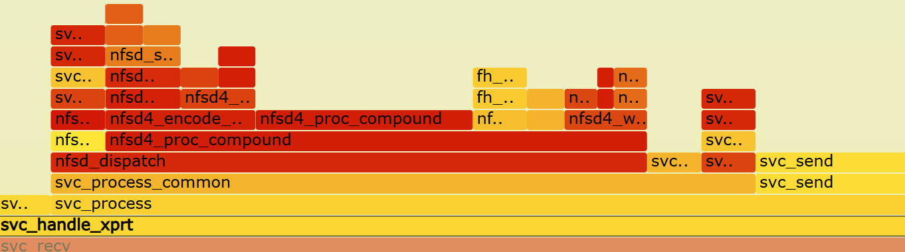

```
static const struct nfsd4_operation nfsd4_ops[] = {
	[OP_ACCESS] = {
		.op_func = nfsd4_access,
		.op_name = "OP_ACCESS",
		.op_rsize_bop = nfsd4_access_rsize,
	},
	[OP_CLOSE] = {
		.op_func = nfsd4_close,
		.op_flags = OP_MODIFIES_SOMETHING,
		.op_name = "OP_CLOSE",
		.op_rsize_bop = nfsd4_status_stateid_rsize,
		.op_get_currentstateid = nfsd4_get_closestateid,
		.op_set_currentstateid = nfsd4_set_closestateid,
	},
	[OP_COMMIT] = {
		.op_func = nfsd4_commit,
		.op_flags = OP_MODIFIES_SOMETHING,
		.op_name = "OP_COMMIT",
		.op_rsize_bop = nfsd4_commit_rsize,
	},
	[OP_CREATE] = {
		.op_func = nfsd4_create,
		.op_flags = OP_MODIFIES_SOMETHING | OP_CACHEME | OP_CLEAR_STATEID,
		.op_name = "OP_CREATE",
		.op_rsize_bop = nfsd4_create_rsize,
	},
	[OP_DELEGRETURN] = {
		.op_func = nfsd4_delegreturn,
		.op_flags = OP_MODIFIES_SOMETHING,
		.op_name = "OP_DELEGRETURN",
		.op_rsize_bop = nfsd4_only_status_rsize,
		.op_get_currentstateid = nfsd4_get_delegreturnstateid,
	},
	[OP_GETATTR] = {
		.op_func = nfsd4_getattr,
		.op_flags = ALLOWED_ON_ABSENT_FS,
		.op_rsize_bop = nfsd4_getattr_rsize,
		.op_name = "OP_GETATTR",
	},
	[OP_GETFH] = {
		.op_func = nfsd4_getfh,
		.op_name = "OP_GETFH",
		.op_rsize_bop = nfsd4_getfh_rsize,
	},
	[OP_LINK] = {
		.op_func = nfsd4_link,
		.op_flags = ALLOWED_ON_ABSENT_FS | OP_MODIFIES_SOMETHING
				| OP_CACHEME,
		.op_name = "OP_LINK",
		.op_rsize_bop = nfsd4_link_rsize,
	},
	[OP_LOCK] = {
		.op_func = nfsd4_lock,
		.op_release = nfsd4_lock_release,
		.op_flags = OP_MODIFIES_SOMETHING |
				OP_NONTRIVIAL_ERROR_ENCODE,
		.op_name = "OP_LOCK",
		.op_rsize_bop = nfsd4_lock_rsize,
		.op_set_currentstateid = nfsd4_set_lockstateid,
	},
	[OP_LOCKT] = {
		.op_func = nfsd4_lockt,
		.op_release = nfsd4_lockt_release,
		.op_flags = OP_NONTRIVIAL_ERROR_ENCODE,
		.op_name = "OP_LOCKT",
		.op_rsize_bop = nfsd4_lock_rsize,
	},
	[OP_LOCKU] = {
		.op_func = nfsd4_locku,
		.op_flags = OP_MODIFIES_SOMETHING,
		.op_name = "OP_LOCKU",
		.op_rsize_bop = nfsd4_status_stateid_rsize,
		.op_get_currentstateid = nfsd4_get_lockustateid,
	},
	[OP_LOOKUP] = {
		.op_func = nfsd4_lookup,
		.op_flags = OP_HANDLES_WRONGSEC | OP_CLEAR_STATEID,
		.op_name = "OP_LOOKUP",
		.op_rsize_bop = nfsd4_only_status_rsize,
	},
	[OP_LOOKUPP] = {
		.op_func = nfsd4_lookupp,
		.op_flags = OP_HANDLES_WRONGSEC | OP_CLEAR_STATEID,
		.op_name = "OP_LOOKUPP",
		.op_rsize_bop = nfsd4_only_status_rsize,
	},
	[OP_NVERIFY] = {
		.op_func = nfsd4_nverify,
		.op_name = "OP_NVERIFY",
		.op_rsize_bop = nfsd4_only_status_rsize,
	},
	[OP_OPEN] = {
		.op_func = nfsd4_open,
		.op_flags = OP_HANDLES_WRONGSEC | OP_MODIFIES_SOMETHING,
		.op_name = "OP_OPEN",
		.op_rsize_bop = nfsd4_open_rsize,
		.op_set_currentstateid = nfsd4_set_openstateid,
	},
	[OP_OPEN_CONFIRM] = {
		.op_func = nfsd4_open_confirm,
		.op_flags = OP_MODIFIES_SOMETHING,
		.op_name = "OP_OPEN_CONFIRM",
		.op_rsize_bop = nfsd4_status_stateid_rsize,
	},
	[OP_OPEN_DOWNGRADE] = {
		.op_func = nfsd4_open_downgrade,
		.op_flags = OP_MODIFIES_SOMETHING,
		.op_name = "OP_OPEN_DOWNGRADE",
		.op_rsize_bop = nfsd4_status_stateid_rsize,
		.op_get_currentstateid = nfsd4_get_opendowngradestateid,
		.op_set_currentstateid = nfsd4_set_opendowngradestateid,
	},
	[OP_PUTFH] = {
		.op_func = nfsd4_putfh,
		.op_flags = ALLOWED_WITHOUT_FH | ALLOWED_ON_ABSENT_FS
				| OP_IS_PUTFH_LIKE | OP_CLEAR_STATEID,
		.op_name = "OP_PUTFH",
		.op_rsize_bop = nfsd4_only_status_rsize,
	},
	[OP_PUTPUBFH] = {
		.op_func = nfsd4_putrootfh,
		.op_flags = ALLOWED_WITHOUT_FH | ALLOWED_ON_ABSENT_FS
				| OP_IS_PUTFH_LIKE | OP_CLEAR_STATEID,
		.op_name = "OP_PUTPUBFH",
		.op_rsize_bop = nfsd4_only_status_rsize,
	},
	[OP_PUTROOTFH] = {
		.op_func = nfsd4_putrootfh,
		.op_flags = ALLOWED_WITHOUT_FH | ALLOWED_ON_ABSENT_FS
				| OP_IS_PUTFH_LIKE | OP_CLEAR_STATEID,
		.op_name = "OP_PUTROOTFH",
		.op_rsize_bop = nfsd4_only_status_rsize,
	},
	[OP_READ] = {
		.op_func = nfsd4_read,
		.op_release = nfsd4_read_release,
		.op_name = "OP_READ",
		.op_rsize_bop = nfsd4_read_rsize,
		.op_get_currentstateid = nfsd4_get_readstateid,
	},
	[OP_READDIR] = {
		.op_func = nfsd4_readdir,
		.op_name = "OP_READDIR",
		.op_rsize_bop = nfsd4_readdir_rsize,
	},
	[OP_READLINK] = {
		.op_func = nfsd4_readlink,
		.op_name = "OP_READLINK",
		.op_rsize_bop = nfsd4_readlink_rsize,
	},
	[OP_REMOVE] = {
		.op_func = nfsd4_remove,
		.op_flags = OP_MODIFIES_SOMETHING | OP_CACHEME,
		.op_name = "OP_REMOVE",
		.op_rsize_bop = nfsd4_remove_rsize,
	},
	[OP_RENAME] = {
		.op_func = nfsd4_rename,
		.op_flags = OP_MODIFIES_SOMETHING | OP_CACHEME,
		.op_name = "OP_RENAME",
		.op_rsize_bop = nfsd4_rename_rsize,
	},
	[OP_RENEW] = {
		.op_func = nfsd4_renew,
		.op_flags = ALLOWED_WITHOUT_FH | ALLOWED_ON_ABSENT_FS
				| OP_MODIFIES_SOMETHING,
		.op_name = "OP_RENEW",
		.op_rsize_bop = nfsd4_only_status_rsize,

	},
	[OP_RESTOREFH] = {
		.op_func = nfsd4_restorefh,
		.op_flags = ALLOWED_WITHOUT_FH | ALLOWED_ON_ABSENT_FS
				| OP_IS_PUTFH_LIKE | OP_MODIFIES_SOMETHING,
		.op_name = "OP_RESTOREFH",
		.op_rsize_bop = nfsd4_only_status_rsize,
	},
	[OP_SAVEFH] = {
		.op_func = nfsd4_savefh,
		.op_flags = OP_HANDLES_WRONGSEC | OP_MODIFIES_SOMETHING,
		.op_name = "OP_SAVEFH",
		.op_rsize_bop = nfsd4_only_status_rsize,
	},
	[OP_SECINFO] = {
		.op_func = nfsd4_secinfo,
		.op_release = nfsd4_secinfo_release,
		.op_flags = OP_HANDLES_WRONGSEC,
		.op_name = "OP_SECINFO",
		.op_rsize_bop = nfsd4_secinfo_rsize,
	},
	[OP_SETATTR] = {
		.op_func = nfsd4_setattr,
		.op_name = "OP_SETATTR",
		.op_flags = OP_MODIFIES_SOMETHING | OP_CACHEME
				| OP_NONTRIVIAL_ERROR_ENCODE,
		.op_rsize_bop = nfsd4_setattr_rsize,
		.op_get_currentstateid = nfsd4_get_setattrstateid,
	},
	[OP_SETCLIENTID] = {
		.op_func = nfsd4_setclientid,
		.op_flags = ALLOWED_WITHOUT_FH | ALLOWED_ON_ABSENT_FS
				| OP_MODIFIES_SOMETHING | OP_CACHEME
				| OP_NONTRIVIAL_ERROR_ENCODE,
		.op_name = "OP_SETCLIENTID",
		.op_rsize_bop = nfsd4_setclientid_rsize,
	},
	[OP_SETCLIENTID_CONFIRM] = {
		.op_func = nfsd4_setclientid_confirm,
		.op_flags = ALLOWED_WITHOUT_FH | ALLOWED_ON_ABSENT_FS
				| OP_MODIFIES_SOMETHING | OP_CACHEME,
		.op_name = "OP_SETCLIENTID_CONFIRM",
		.op_rsize_bop = nfsd4_only_status_rsize,
	},
	[OP_VERIFY] = {
		.op_func = nfsd4_verify,
		.op_name = "OP_VERIFY",
		.op_rsize_bop = nfsd4_only_status_rsize,
	},
	[OP_WRITE] = {
		.op_func = nfsd4_write,
		.op_flags = OP_MODIFIES_SOMETHING | OP_CACHEME,
		.op_name = "OP_WRITE",
		.op_rsize_bop = nfsd4_write_rsize,
		.op_get_currentstateid = nfsd4_get_writestateid,
	},
	[OP_RELEASE_LOCKOWNER] = {
		.op_func = nfsd4_release_lockowner,
		.op_flags = ALLOWED_WITHOUT_FH | ALLOWED_ON_ABSENT_FS
				| OP_MODIFIES_SOMETHING,
		.op_name = "OP_RELEASE_LOCKOWNER",
		.op_rsize_bop = nfsd4_only_status_rsize,
	},

	/* NFSv4.1 operations */
	[OP_EXCHANGE_ID] = {
		.op_func = nfsd4_exchange_id,
		.op_flags = ALLOWED_WITHOUT_FH | ALLOWED_AS_FIRST_OP
				| OP_MODIFIES_SOMETHING,
		.op_name = "OP_EXCHANGE_ID",
		.op_rsize_bop = nfsd4_exchange_id_rsize,
	},
	[OP_BACKCHANNEL_CTL] = {
		.op_func = nfsd4_backchannel_ctl,
		.op_flags = ALLOWED_WITHOUT_FH | OP_MODIFIES_SOMETHING,
		.op_name = "OP_BACKCHANNEL_CTL",
		.op_rsize_bop = nfsd4_only_status_rsize,
	},
	[OP_BIND_CONN_TO_SESSION] = {
		.op_func = nfsd4_bind_conn_to_session,
		.op_flags = ALLOWED_WITHOUT_FH | ALLOWED_AS_FIRST_OP
				| OP_MODIFIES_SOMETHING,
		.op_name = "OP_BIND_CONN_TO_SESSION",
		.op_rsize_bop = nfsd4_bind_conn_to_session_rsize,
	},
	[OP_CREATE_SESSION] = {
		.op_func = nfsd4_create_session,
		.op_flags = ALLOWED_WITHOUT_FH | ALLOWED_AS_FIRST_OP
				| OP_MODIFIES_SOMETHING,
		.op_name = "OP_CREATE_SESSION",
		.op_rsize_bop = nfsd4_create_session_rsize,
	},
	[OP_DESTROY_SESSION] = {
		.op_func = nfsd4_destroy_session,
		.op_flags = ALLOWED_WITHOUT_FH | ALLOWED_AS_FIRST_OP
				| OP_MODIFIES_SOMETHING,
		.op_name = "OP_DESTROY_SESSION",
		.op_rsize_bop = nfsd4_only_status_rsize,
	},
	[OP_SEQUENCE] = {
		.op_func = nfsd4_sequence,
		.op_flags = ALLOWED_WITHOUT_FH | ALLOWED_AS_FIRST_OP,
		.op_name = "OP_SEQUENCE",
		.op_rsize_bop = nfsd4_sequence_rsize,
	},
	[OP_DESTROY_CLIENTID] = {
		.op_func = nfsd4_destroy_clientid,
		.op_flags = ALLOWED_WITHOUT_FH | ALLOWED_AS_FIRST_OP
				| OP_MODIFIES_SOMETHING,
		.op_name = "OP_DESTROY_CLIENTID",
		.op_rsize_bop = nfsd4_only_status_rsize,
	},
	[OP_RECLAIM_COMPLETE] = {
		.op_func = nfsd4_reclaim_complete,
		.op_flags = ALLOWED_WITHOUT_FH | OP_MODIFIES_SOMETHING,
		.op_name = "OP_RECLAIM_COMPLETE",
		.op_rsize_bop = nfsd4_only_status_rsize,
	},
	[OP_SECINFO_NO_NAME] = {
		.op_func = nfsd4_secinfo_no_name,
		.op_release = nfsd4_secinfo_no_name_release,
		.op_flags = OP_HANDLES_WRONGSEC,
		.op_name = "OP_SECINFO_NO_NAME",
		.op_rsize_bop = nfsd4_secinfo_rsize,
	},
	[OP_TEST_STATEID] = {
		.op_func = nfsd4_test_stateid,
		.op_flags = ALLOWED_WITHOUT_FH,
		.op_name = "OP_TEST_STATEID",
		.op_rsize_bop = nfsd4_test_stateid_rsize,
	},
	[OP_FREE_STATEID] = {
		.op_func = nfsd4_free_stateid,
		.op_flags = ALLOWED_WITHOUT_FH | OP_MODIFIES_SOMETHING,
		.op_name = "OP_FREE_STATEID",
		.op_get_currentstateid = nfsd4_get_freestateid,
		.op_rsize_bop = nfsd4_only_status_rsize,
	},
#ifdef CONFIG_NFSD_PNFS
	[OP_GETDEVICEINFO] = {
		.op_func = nfsd4_getdeviceinfo,
		.op_release = nfsd4_getdeviceinfo_release,
		.op_flags = ALLOWED_WITHOUT_FH,
		.op_name = "OP_GETDEVICEINFO",
		.op_rsize_bop = nfsd4_getdeviceinfo_rsize,
	},
	[OP_LAYOUTGET] = {
		.op_func = nfsd4_layoutget,
		.op_release = nfsd4_layoutget_release,
		.op_flags = OP_MODIFIES_SOMETHING,
		.op_name = "OP_LAYOUTGET",
		.op_rsize_bop = nfsd4_layoutget_rsize,
	},
	[OP_LAYOUTCOMMIT] = {
		.op_func = nfsd4_layoutcommit,
		.op_flags = OP_MODIFIES_SOMETHING,
		.op_name = "OP_LAYOUTCOMMIT",
		.op_rsize_bop = nfsd4_layoutcommit_rsize,
	},
	[OP_LAYOUTRETURN] = {
		.op_func = nfsd4_layoutreturn,
		.op_flags = OP_MODIFIES_SOMETHING,
		.op_name = "OP_LAYOUTRETURN",
		.op_rsize_bop = nfsd4_layoutreturn_rsize,
	},
#endif /* CONFIG_NFSD_PNFS */

	/* NFSv4.2 operations */
	[OP_ALLOCATE] = {
		.op_func = nfsd4_allocate,
		.op_flags = OP_MODIFIES_SOMETHING,
		.op_name = "OP_ALLOCATE",
		.op_rsize_bop = nfsd4_only_status_rsize,
	},
	[OP_DEALLOCATE] = {
		.op_func = nfsd4_deallocate,
		.op_flags = OP_MODIFIES_SOMETHING,
		.op_name = "OP_DEALLOCATE",
		.op_rsize_bop = nfsd4_only_status_rsize,
	},
	[OP_CLONE] = {
		.op_func = nfsd4_clone,
		.op_flags = OP_MODIFIES_SOMETHING,
		.op_name = "OP_CLONE",
		.op_rsize_bop = nfsd4_only_status_rsize,
	},
	[OP_COPY] = {
		.op_func = nfsd4_copy,
		.op_flags = OP_MODIFIES_SOMETHING,
		.op_name = "OP_COPY",
		.op_rsize_bop = nfsd4_copy_rsize,
	},
	[OP_READ_PLUS] = {
		.op_func = nfsd4_read,
		.op_release = nfsd4_read_release,
		.op_name = "OP_READ_PLUS",
		.op_rsize_bop = nfsd4_read_plus_rsize,
		.op_get_currentstateid = nfsd4_get_readstateid,
	},
	[OP_SEEK] = {
		.op_func = nfsd4_seek,
		.op_name = "OP_SEEK",
		.op_rsize_bop = nfsd4_seek_rsize,
	},
	[OP_OFFLOAD_STATUS] = {
		.op_func = nfsd4_offload_status,
		.op_name = "OP_OFFLOAD_STATUS",
		.op_rsize_bop = nfsd4_offload_status_rsize,
	},
	[OP_OFFLOAD_CANCEL] = {
		.op_func = nfsd4_offload_cancel,
		.op_flags = OP_MODIFIES_SOMETHING,
		.op_name = "OP_OFFLOAD_CANCEL",
		.op_rsize_bop = nfsd4_only_status_rsize,
	},
	[OP_COPY_NOTIFY] = {
		.op_func = nfsd4_copy_notify,
		.op_flags = OP_MODIFIES_SOMETHING,
		.op_name = "OP_COPY_NOTIFY",
		.op_rsize_bop = nfsd4_copy_notify_rsize,
	},
	[OP_GETXATTR] = {
		.op_func = nfsd4_getxattr,
		.op_name = "OP_GETXATTR",
		.op_rsize_bop = nfsd4_getxattr_rsize,
	},
	[OP_SETXATTR] = {
		.op_func = nfsd4_setxattr,
		.op_flags = OP_MODIFIES_SOMETHING | OP_CACHEME,
		.op_name = "OP_SETXATTR",
		.op_rsize_bop = nfsd4_setxattr_rsize,
	},
	[OP_LISTXATTRS] = {
		.op_func = nfsd4_listxattrs,
		.op_name = "OP_LISTXATTRS",
		.op_rsize_bop = nfsd4_listxattrs_rsize,
	},
	[OP_REMOVEXATTR] = {
		.op_func = nfsd4_removexattr,
		.op_flags = OP_MODIFIES_SOMETHING | OP_CACHEME,
		.op_name = "OP_REMOVEXATTR",
		.op_rsize_bop = nfsd4_removexattr_rsize,
	},
};
```

统一的数据结构定义
```

struct nfsd4_operation {
	__be32 (*op_func)(struct svc_rqst *, struct nfsd4_compound_state *,
			union nfsd4_op_u *);
	void (*op_release)(union nfsd4_op_u *);
	u32 op_flags;
	char *op_name;
	/* Try to get response size before operation */
	u32 (*op_rsize_bop)(const struct svc_rqst *rqstp,
			const struct nfsd4_op *op);
	void (*op_get_currentstateid)(struct nfsd4_compound_state *,
			union nfsd4_op_u *);
	void (*op_set_currentstateid)(struct nfsd4_compound_state *,
			union nfsd4_op_u *);
};
```

第一个参数包含相关rpc信息:

```

/*
 * The context of a single thread, including the request currently being
 * processed.
 */
struct svc_rqst {
	struct list_head	rq_all;		/* all threads list */
	struct llist_node	rq_idle;	/* On the idle list */
	struct rcu_head		rq_rcu_head;	/* for RCU deferred kfree */
	struct svc_xprt *	rq_xprt;	/* transport ptr */

	struct sockaddr_storage	rq_addr;	/* peer address */
	size_t			rq_addrlen;
	struct sockaddr_storage	rq_daddr;	/* dest addr of request
						 *  - reply from here */
	size_t			rq_daddrlen;

	struct svc_serv *	rq_server;	/* RPC service definition */
	struct svc_pool *	rq_pool;	/* thread pool */
	const struct svc_procedure *rq_procinfo;/* procedure info */
	struct auth_ops *	rq_authop;	/* authentication flavour */
	struct svc_cred		rq_cred;	/* auth info */
	void *			rq_xprt_ctxt;	/* transport specific context ptr */
	struct svc_deferred_req*rq_deferred;	/* deferred request we are replaying */

	struct xdr_buf		rq_arg;
	struct xdr_stream	rq_arg_stream;
	struct xdr_stream	rq_res_stream;
	struct page		*rq_scratch_page;
	struct xdr_buf		rq_res;
	struct page		*rq_pages[RPCSVC_MAXPAGES + 1];
	struct page *		*rq_respages;	/* points into rq_pages */
	struct page *		*rq_next_page; /* next reply page to use */
	struct page *		*rq_page_end;  /* one past the last page */

	struct folio_batch	rq_fbatch;
	struct kvec		rq_vec[RPCSVC_MAXPAGES]; /* generally useful.. */
	struct bio_vec		rq_bvec[RPCSVC_MAXPAGES];

	__be32			rq_xid;		/* transmission id */
	u32			rq_prog;	/* program number */
	u32			rq_vers;	/* program version */
	u32			rq_proc;	/* procedure number */
	u32			rq_prot;	/* IP protocol */
	int			rq_cachetype;	/* catering to nfsd */
	unsigned long		rq_flags;	/* flags field */
	ktime_t			rq_qtime;	/* enqueue time */

	void *			rq_argp;	/* decoded arguments */
	void *			rq_resp;	/* xdr'd results */
	__be32			*rq_accept_statp;
	void *			rq_auth_data;	/* flavor-specific data */
	__be32			rq_auth_stat;	/* authentication status */
	int			rq_auth_slack;	/* extra space xdr code
						 * should leave in head
						 * for krb5i, krb5p.
						 */
	int			rq_reserved;	/* space on socket outq
						 * reserved for this request
						 */
	ktime_t			rq_stime;	/* start time */

	struct cache_req	rq_chandle;	/* handle passed to caches for 
						 * request delaying 
						 */
	/* Catering to nfsd */
	struct auth_domain *	rq_client;	/* RPC peer info */
	struct auth_domain *	rq_gssclient;	/* "gss/"-style peer info */
	struct task_struct	*rq_task;	/* service thread */
	struct net		*rq_bc_net;	/* pointer to backchannel's
						 * net namespace
						 */
	unsigned long	bc_to_initval;
	unsigned int	bc_to_retries;
	void **			rq_lease_breaker; /* The v4 client breaking a lease */
	unsigned int		rq_status_counter; /* RPC processing counter */
};
```

rpc的接受函数svc_recv中的函数参数也是上述结构体，经过处理路径如下：
<div align="center">

</div>

